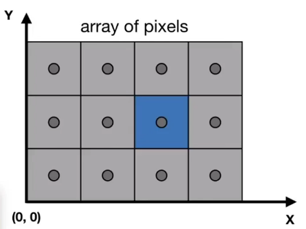

# 光栅化（把东西画在屏幕上）

## 屏幕

### 概念

- 是一个二维数组
- 基本单位是像素（resolution）
- 屏幕是一个典型的光栅成像设备

### 光栅（Raster）

- 在德语中表示屏幕
- 将东西画进屏幕中

### 像素（Pixel）

- 是"picture element"的缩写
- 颜色由RGB混合而成

### 屏幕空间

## 将投影转换的立方体转化到屏幕上

