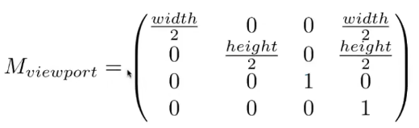

# 光栅化（把东西画在屏幕上）

## 屏幕

### 概念

- 是一个二维数组
- 基本单位是像素（resolution）
- 屏幕是一个典型的光栅成像设备

### 光栅（Raster）

- 在德语中表示屏幕
- 将东西画进屏幕中

### 像素（Pixel）

- 是"picture element"的缩写
- 颜色由RGB混合而成

### 屏幕空间

- 坐标的索引是整型
- 范围是(0，0)到(width - 1, height -1)
- (x, y)对应的像素，其中心坐标是(x + 0.5, y + 0.5)
## 将投影转换的立方体转化到屏幕上

- 先不管z轴
- 将\[-1到1\]的二维面转换到\[0, width\]x\[0, height\]上
- 视口变换
	

## 三角网格

### 为什么是三角形？

- 最基础的图形
	- 可以将任意多边形拆成多个三角形
- 特有的性质
	- 三角形内部是平面
	- 三角形的内外区分是清晰的（可以通过向量的叉乘计算点是否在三角形内：[[review-of-linear-algebra]]）
	- 可以将三角形内部的插值计算出来，根据三个顶点位置计算：中心坐标插值

### 如何判断一个三角形光栅化后的像素值

