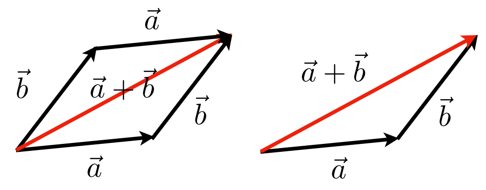
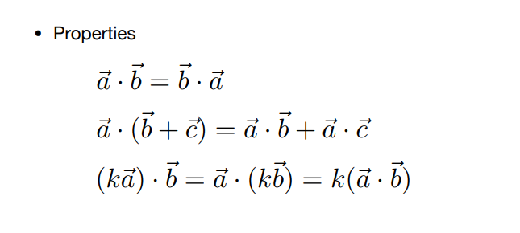
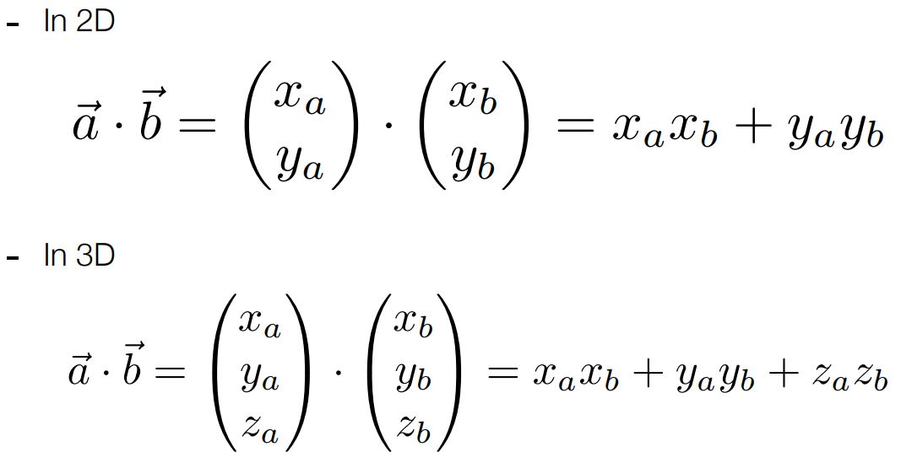
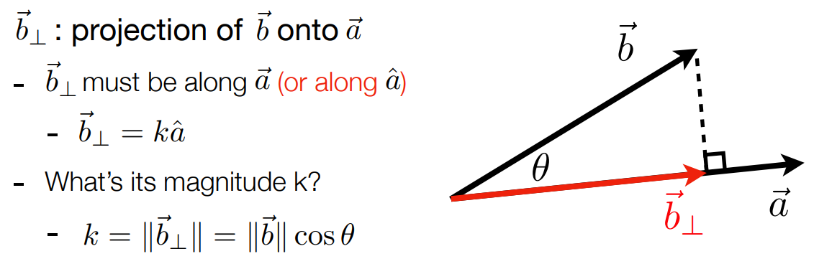
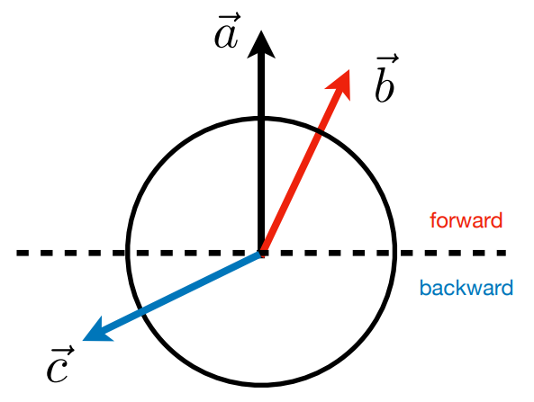
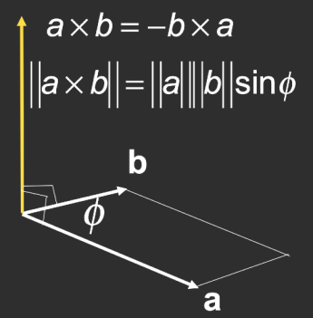
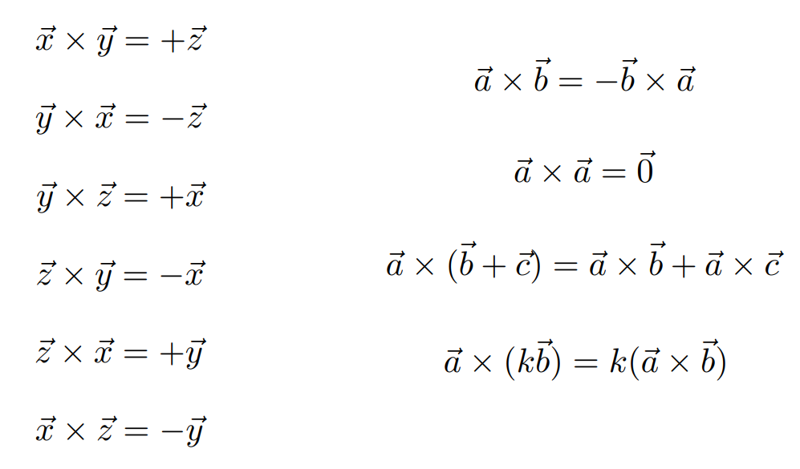
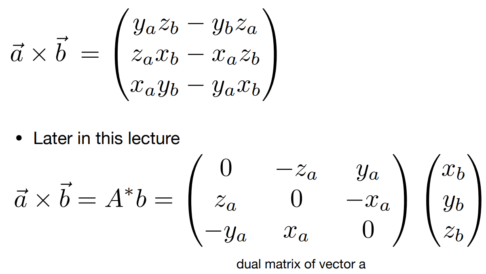

# 回顾线性代数

## 图形学所依赖基础

源：[GAMES101_Lecture_02 (ucsb.edu)](https://sites.cs.ucsb.edu/~lingqi/teaching/resources/GAMES101_Lecture_02.pdf)

- 基础数学
  - 线性代数
  - 微积分
  - 统计学
- 基础物理学
  - 光学
  - 机械原理
- 工程学
  - 信息处理
  - 数据分析

## 向量（Vectors）

- **笛卡尔坐标系**
  - X和Y分量能被正交分解成任意单位向量$$ A=\dbinom{x}{y}$$$$\mathbf{A}^\mathrm{T} = (x, y)$$ $$||A||=\sqrt{x^2+y^2}$$
- 向量的表示
- 一般写成箭头或粗体 $$\vec{a} 或 \boldsymbol{a}$$
  - 也可以使用两点进行表达（终点减去起点）$$ \vec{AB} = B-A $$
  - 可通过向量知道方向以及长度
  - 无需绝对的起点(==原因？==)
- 向量模长的表示 $$ ||\vec{a}||$$
- 单位向量
  - 向量的长度为1的向量称之为单位向量
  - 可求得某个一个向量的单位向量（归一化）$$\hat{a} = \vec{a} / ||\vec{a}||$$
  - 常用来表示向量的方向

### 向量加法（Vector Addition）

- 几何表示：四边形法则 / 三角形法则（可以以运动的角度去思考...）
- 代数表示：简单的对应项相加

### 向量乘法（Vector Multiplication）

### 向量点乘（dot product）-> 数量积，标量

#### 计算原理

一般向量的计算：$$\vec{a}·\vec{b}=||a||·||b||·\cos{\theta}$$
$$\cos{\theta}=\frac{\vec{a}·\vec{b}}{||a||·||b||}$$
对于**单位向量**而言，这对于计算向量的夹角特别有用，可以将向量归一化为单位向量，再通过点乘，就可以得到夹角的余弦值，进而计算出夹角角度：$$\cos{\theta}=\vec{a}·\vec{b}$$

#### 向量点乘支持的计算规则

- 交换律
- 分配律
- 结合律

#### 笛卡尔坐标系中的点乘

对应坐标的元素相乘，最后求和即可

#### 向量点乘在图形学的应用

- 计算两个向量之间的夹角
  - eg: 点光源与物体表面的余弦值
- 计算一个向量在另一个向量上的**投影**
  - eg: 阴影计算 
- 计算两个向量的距离
- 正交分解（分解一个向量）
- 判断位置的前和后（根据余弦的图像可知，夹角小于90度则为正，即为前面；大于90小于180则为负，即为后面）

### 向量叉乘（cross product）-> 向量积，向量

#### 计算原理

- 叉乘后的向量是两个向量的正交向量
- 叉乘向量的方向是通过右手坐标系决定的，因此，可以根据叉乘后的向量判断坐标系（左手系/右手系）
- 在笛卡尔坐标系中很有用？

#### 向量叉乘支持的计算规则

#### 向量叉乘的笛卡尔坐标系表示

### 矩阵（Matrices）
