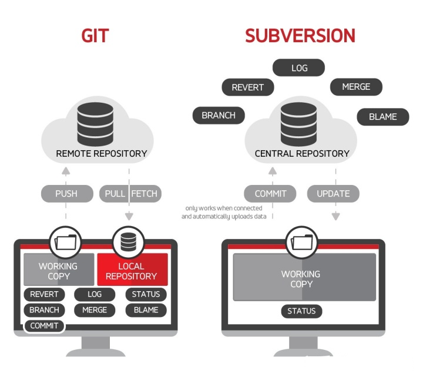

<!-- markdownlint-disable line_length -->
# Git

> Git is a free and open source distributed version control system designed
> to handle everything from small to very large projects with speed and efficiency.
> —— Git是一个免费的开源分布式版本控制系统，可以快速高效地处理从小到大的所有项目。

`Git`是[Linus Torvalds](https://baike.baidu.com/item/林纳斯·本纳第克特·托瓦兹/1034429)为了帮助管理Linux内核开发而开发的一个开放源码的版本控制软件

## Git vs. SVN



### 联系与区别

1. **核心架构不同**（**最核心的区别**）：`Git`是**分布式**的版本控制系统，而`SVN`是**集中式**的，因此，`Git`支持离线工作，`SVN`必须联网才能工作
2. **概念和指令不同**：`SVN`概念和指令较少，上手容易，而`Git`概念多且复杂，如`add`、`commit`、`push`、`fetch`、`pull`等等，概念多但也意味着功能更加强大
3. **分支管理不同**：`Git`可以有本地分支，且分支的指针指向的某次提交，而`SVN`没有本地分支，它的分支只是一个拷贝的目录。
  因此，`Git`分支创建和切换十分便捷，并且在开发过程中遇到突发事情需要另外处理时，使用`Git`的`stash`将当前改动临时存储，使得分支管理更加灵活

|                | Git                                                                        | SVN                                                        |
| -------------- | -------------------------------------------------------------------------- | ---------------------------------------------------------- |
| 服务器架构     | 在本地安装并充当服务器和客户端                                             | 需要中央服务器和用户客户端                                 |
| 修订           | Git 是一个 SCM（源代码管理）工具。因此，它没有全局修订号                   | SVN 是一个版本控制系统。因此，它具有全局修订号             |
| 存储库克隆     | 支持                                                                       | 不支持                                                     |
| 存储格式       | 元数据                                                                     | 文件                                                       |
| 存储要求       | 处理大型二进制文件的能力有限                                               | 除了代码之外，还可以处理大型二进制文件                     |
| 分支           | 分支是对某个提交的引用。可以随时创建、删除和更改它们，而不会影响其他提交。 | 分支被创建为存储库内的目录，当分支准备好时，它被提交回主干 |
| 访问控制和权限 | 允许所有贡献者对整个代码库具有相同的权限                                   | 允许对每个文件级别和每个目录级别进行读写访问控制的细化权限 |
| 上手容易度     | 困难                                                                       | 简单                                                       |
| 加密散列       | 为了防止存储库损坏（由于网络问题或磁盘故障），Git 对内容进行哈希加密。     | 不适用                                                     |
| 许可证         | GNU（通用公共许可证）                                                      | 在 Apache 许可下开源                                       |
| 变更追踪       | 存储库级别                                                                 | 文件级别                                                   |
| 原开发者       | Linus Torvalds（为 Linux 内核代码控制而开发）                              | CollabNet公司                                              |  |  |

## 安装与配置

### 安装

前往[Git](https://git-scm.com/)官网下载安装包，默认安装即可

### 配置(SSH)

- 修改本地配置config

  ```sh
  # 设置全局用户名称
  git config --global user.name <username>
  # 设置全局用户邮箱
  git config --global user.email <email>
  ```

- 打开`Git Bash`，生成rsa文件，以及ssh

  ```sh
  # 生成新的ssh
  # <email>: 电子邮箱
  #-t: 密钥类型, 可以选择 dsa | ecdsa | ed25519 | rsa;
  #-b: 指定密钥长度
  #-f: 密钥目录位置, 默认为当前用户home路径下的.ssh隐藏目录, 也就是~/.ssh/, 同时默认密钥文件名以id_rsa开头. 如果是root用户, 则在/root/.ssh/id_rsa, 若为其他用户, 则在/home/<username>/.ssh/id_rsa;
  #-C: 指定此密钥的备注信息, 需要配置多个免密登录时, 建议携带;
  ssh-keygen -t rsa -b 4096 -C "<email>"

  # 按回车三次
  # 查看生成的文件，并复制至Github上
  cat ~/.ssh/id_rsa.pub
  ```

- 在Github上创建ssh key
  - 找到并打开`Settings`，找到`SSH adn GPG keys`项(<https://github.com/settings/keys>)
  - 点击`New SSH key`，将复制的内容粘贴至`Key`文本框，并设置好`Title`
  - 保存，即`Add SSH key`

- 检查是否能够通过SSH与GitHub通信
  - 如果出现`Hi xxx! You've successfully authenticated, but GitHub does not provide shell access.`，说明配置成功；
  - 如果出现`Permission denied (publickey).`，说明配置失败，需要重新操作。

  ```sh
  # -T: 禁止分配伪终端
  ssh -T git@github.com
  # 若有提示则输入yes
  ```

## 基本使用

### 基本概念


- **Workspace**：工作区，也称<u>工作副本</u>，就是计算机上的一个目录。开发者日常主要的开发工作都在这完成
  - 基于开发分支`develop`创建的特性分支`feature/xxx`，进行功能模块开发\
  - 基于开发分支`develop`创建的版本分支`release/x.x.x`，进行版本的发布说明
  - 基于主分支`main`的热修复分支`hotfix/xxx`，对上线的产品进行快速修复
  - 等等...
- **Respository**：本地版本库，也称为<u>本地仓库</u>。在这既可以与工作空间的状态进行管理（主要是对分支的管理操作）：切换本地分支、本地版本库与远程版本库的改动推送/拉取
- **Remote**: 远程版本库，也称为<u>远程仓库</u>。用于存储各种正式代码分支，与本地版本库进行相关操作
  - 主分支`main`
  - 开发分支`develop`
  - 等等...
- **Index**：暂存区，类似缓存的地方，临时保存修改内容：比如新增改动、提交改动、暂存/恢复先前修改。每次操作后生成的索引值（基于`SHA-1`算法生成的哈希校验和），一般只需要确认其前3~4位就能够找到对应的改动记录。

### 工作区(Workspace)管理

#### 文件状态

在Git中，文件状态分为`已跟踪`和`未跟踪`，除了已跟踪的文件以外，其他都是未跟踪文件。
已跟踪的文件是指那些被纳入了版本控制的文件，经过一段时间的工作后，状态可能是如下四种：

- **Untracked**(未跟踪)：未被Git跟踪的文件，一般为新建/删除文件
- **Unmodified**(未改动)：已被Git跟踪的文件，但在工作过程中未被修改的文件
- **Modified**(有改动)：已被Git跟踪的文件，并且在工作中发生改动的文件
- **Staged**(已暂存)：已被Git跟踪的文件，并且已被添加至暂存区


#### 常用指令

- **查看状态**

  `git status`查看当前工作区的文件状态，如当前处在的分支、改动的文件、未跟踪的文件等...

  ```sh
  # -s: 状态简览
  git status [--short|-s]
  ```

- **跟踪新增的文件/暂存已修改的文件**

  `git add`不仅可以跟踪新增文件，还能够将已修改的文件进行暂存，
  每次`add`都将文件添加至暂存区，并且生成一个索引值，该索引值标识此次提交的工作树(working tree)的快照，快照的内容用于后续暂存的提交。

  ```sh
  # pathspec: 具体暂存文件的路径
  git add [file1] [file2] ...
  # 将所有改动的文件添加至暂存区，不管是否原本已经存在提交索引
  git add -A
  # 将当前目录下的所有文件添加至暂存区
  git add .
  # 强制新增改动，一般用于新增.gitignore文件的改动
  git add -f
  ```

- **查看已暂存和未暂存的修改**

  `git diff`可以将当前工作副本与暂存区的工作树进行对比，发现改动的文件以及改动的内容；也可以查看已暂存的将要添加到下次提交的改动内容

  ```sh
  # 查看当前工作区与最近一次暂存内容的改动区别
  git diff
  # 查看已暂存的将要添加到下次提交里的内容的改动区别
  git diff [--cached|--staged]
  ```

- **提交暂存的修改**

  将暂存区的改动内容提交至本地仓库，在此之前需要确认是否还有改动遗漏，有则需要再`git add`添加改动，否则接下来的提交不会记录尚未暂存的改动。
  因此，可以先`git status`查看当前工作区状态，确保都暂存再执行`git commit`

  ```sh
  # 会自动启动编辑器来输入提交信息
  git commit
  # -m：提交信息
  git commit -m "<message>"
  # -a: 跳过git add过程，直接跟踪的文件暂存起来并提交
  git commit -a -m "<message>"
  ```

- **移除文件**

  `git rm`能够将文件从**暂存区**和**工作区**中移除文件，这是彻底的移除文件。
  如果只是简单的从**工作区**删除文件，在`git status`中能看到删除的文件的改动状态则会变成`deleted`，然后再使用`git rm`将该文件改动添加至暂存区

  ```sh
  # 将工作区和暂存区的指定文件移除
  git rm [file]
  # 将暂存区的指定文件移除，但保留工作区中的对应文件
  git rm --cached [file]
  ```

- **移动文件/文件更名**

  在Git中，移动文件可以使用`git mv`完成，正如Linux的`mv`一样，能够移动文件，也能够更改文件名。
  若是更改文件名称，在`git status`中能看到更名的文件的改动状态则会变成`renamed`。
  本质上，使用`git mv`更名也是一次文件的删除`rm`再添加`add`

  ```sh
  git mv file_from file_to
  ```

### 版本库(Repository)管理

#### 本地版本库(Local)管理

- **获取Git仓库**

```sh
# 将当前文件夹初始化为Git仓库
git init
# 将远程仓库克隆至本地
# url：协议地址(HTTPS|SSH)
# dirname: 新目录名称
git clone <url> [<dirname>]
```

- **查看提交历史**

  `git log`会根据时间顺序列出所有的提交，最近的一次提交列在最上面，
  并且列出每个提交的 **SHA-1 校验和**、**作者的名字和电子邮件地址**、**提交时间**以及**提交说明**

```sh
# -p: 列出每次的修改内容
# --stat：列出每次文件修改统计信息
# --graph：使用ASCII字符列出分支、合并历史
# --pretty: 美化日志格式，format=oneline | short | full | fuller，还支持format自定义格式化
# -n：列出最近几次的提交日志
# --since, --after: 时间过滤，从什么时候开始--since='2022-11-22'
# --until, --before: 时间过滤，在什么时候之前--since='2022-11-22'
# --author：作者过滤
# ...
git log [-p|--patch] [--stat] [--graph] [--pretty=<format>] [-<n>] [--since= | --after=] [--until= | --before=] [--author=]

# 一行输出日志信息
git log --pretty=oneline

# 自定义格式化输出日志："哈希值 - 作者名称, 据当下多长时间 : 提交说明"
git log --pretty=format:"%h - %an, %ar : %s"
# 自定义格式化+分支、合并情况的日志
git log --pretty=format:"%h %s" --graph
```

- **创建/切换分支**

  创建本地分支可用`git branch`，
  切换本地分支用的HEAD指向可用`git switch`或`git checkout`，
  **`git checkout`不仅能用于创建分支，还可以切换分支。**

  ```sh
  # 创建【本地】分支
  git branch <local>
  # 切换【本地】分支，即将HEAD指针指向该分支
  git switch <local>
  git checkout <local>
  # 创建并切换【本地】分支，并将HEAD指针指向该分支
  git checkout -b <local>
  ```

- **合并分支**

  Git的合并有两种方式：`merge`和`rebase`。它们各有特点，根据不同场景选择使用能够实现较为理想的效果

  - **merge**

    当想将检出的分支合并至某一分支中（如`main`），则可以先切换至该分支`main`，然后合并检出的分支。

    可能会出现`快速前进(fast-forward)`，即**当两个分支需要合并时，如果一个分支能够顺着移动到另一个分支，则Git在合并时，只会简单的将指针向前推进**；
    合并时也可能会出现冲突，因此需要解决完后，通过`git add`将文件暂存，确定冲突已解决，再`git commit`提交此次合并

    ```sh
    git checkout <breach>
    git merge <target>
    # 可视化合并工具
    git mergetool
    ```

  - **rebase**

    **基变**(rebase)是将一个主题分支的修改通过“备份”，依序合并至目标基底分支上，并且丢弃掉主题分支上的所有提交记录，使得分支的提交记录更加地“线性”，更加清晰。

    但是需要注意的是，**如果提交存在于本地仓库之外，而其他人可能基于这些提交进行开发，那么不要执行变基**。

    ```sh
    # 将当前分支合并至<basebranch>，如果传入<topicbranch>，则会合并将HEAD指向<topicbranch>
    # -i：交互模式，能够修改版本提交的顺序。
    # basebranch：目标基底分支
    # topicbranch：主题分支
    git rebase [-i|--interactive] <basebranch> [<topicbranch>]
    ```

- **拉取**
  
  主要有两种方式：`fetch`和`pull`
  
  1. `fetch`：拉取远程仓库代码到新分支，不合并当前分支的改动，需要手动merge，因此`fetch`后常与`merge`配合使用
  2. `pull`：拉去远程代码到本地，并自动合并当前改动
  
  ```sh
  # fetch + merge
  git fetch [origin <remote>[:<local>]] [--all]
  git merge <remote>

  # pull
  # --rebase：拉取并基变远程仓库到本地，防止他人将基变推送至远程仓库导致记录缺失
  git pull [--rebase] [origin <remote>:<local>] 
  ```

- **推送**

  ```sh
  # 推送提交代码至远程仓库
  git push
  ```

- **删除分支**

  删除分支主要使用`branch`和参数`-d/-D`控制

  1. `-d`：常规删除
  2. `-D`：强制删除，相当于`--delete --force`

  ```sh
  # 删除【本地】分支
  # 常规删除
  git branch -d <local>
  # 强制删除
  git branch -D <local>
  ```

#### 远程版本库(Remote)管理

与本地仓库类似，远程仓库也存在分支、标签等，其分支以`<remote>/<branch>`的形式命名，`remote`的名称一般为origin，在检出远程分支时也能够重命名。

- **创建分支**

  ```sh
  # 创建并切换分支
  git push <remote> <localbranch>:<remotebranch>
  ```

- **删除分支**

  ```sh
  # 删除【远程】分支
  # 常规删除
  git push <remote> [-d|--delete] <localbranch>
  # 强制删除
  git push <remote> -D <localbranch>
  # 推送空分支
  git push <remote> :<localbranch>
  ```

- **跟踪分支**

  ```sh
  # 当存在本地分支，想远程创建同名分支+跟踪
  git push <remote> [-u|--set-upstream] <local>
  # 当远程存在分支，想本地创建同名分支+跟踪
  # track：跟踪分支
  # alias：分支重命名，默认与远程分支相同
  git checkout -b [--track] [alias] <remote>/<remotebranch>
  ```

### 暂存区(Index)管理

- **撤销操作**
  - 撤销提交，当提交信息填写错误或者漏掉几个文件没有添加至暂存区，因此需要撤销原本的提交，运行带上`--amend`参数的提交命令即可。
    如果自上次提交以来没有做任何修改而执行带`--amend`参数提交指令，Git会保持原来的快照，只修改提交信息；
    如果做了修改，则需要将改动的文件`add`后，再执行带`--amend`参数提交指令，这次提交会启动文本编辑器，并显示第一次提交信息，
    在此基础上修改后作为第二次提交信息，第二次提交会代替第一次提交的结果。

    ```sh
    git commit --amend
    ```

  - 对已在暂存区的文件撤销，例如添加两个文件修改至暂存库，需要撤销其中一个文件的改动，则可以使用`git reset`或`git restore`；
  - 撤销工作区的文件修改，恢复到上一次提交时的样子，使用`git reset`或`git restore`也可以实现

    ```sh
    git reset HEAD [file1]...
    git restore [file1]...
    ```

## 进阶使用

### Git Hook

钩子(Hook)一般是在执行特定动作时触发一些自定义脚本，Git中的钩子存放在`.git/hooks`目录下，当初始化Git仓库后，会默认存放后缀为`.sample`的钩子示例。
若需要开启，只需要移除这个后缀即可。

Git中存在两大类钩子：`客户端钩子`和`服务端钩子`。客户端钩子主要用于提交合并前后的操作。服务端钩子主要用于接收被推送的提交的联网操作。

- 客户端钩子
  - 提交工作流钩子
    - **`pre-commit`**：在输入提交信息前运行。它用于检查即将提交的快照，常用于查找受否存在遗漏，测试运行是否正常，代码编写是否规范等等...
    - **`prepare-commit-msg`**：在启动提交信息编辑器之前，默认信息被创建之后运行。常与提交信息模板搭配使用，动态插入信息
    - **`commit-msg`**：在提交信息时的运行。如果以钩子脚本非零值退出，Git将放弃提交。常用于在提交通过前验证项目状态或提交信息
    - **`post-commit`**：在整个提交过程完成后运行。一般用于通知之类的事情
  - 电子邮件工作流钩子
    - **`applypatch-msg`**
    - **`applypatch-msg`**
    - **`post-applypatch`**
  - 其它客户端钩子
    - **`pre-rebase`**
    - **`post-rewrite`**
    - **`post-checkout`**
    - **`post-merge`**
    - **`pre-push`**
- 服务端钩子
  - **`pre-receive`**
  - **`update`**
  - **`post-receive`**

## 团队协作流程


目前主流的Git团队协作开发主要用主分支`master|main`和开发分支`develop`来记录开发历史，而开发者的所有开发活动都基于开发分支上进行。

- `master`：主分支，也可以命名为`main`（`main`的命名是因为BLM运动而出现），这是仓库最主要、最稳定的代码版本，一般只有管理员有写入权限，用于保存发布版本历史，顺便打标签。
- `develop`：开发分支，一般各种开发活动最终需要集成到该分支。后续考虑代码版本发布时，会基于该分支检出一个发布分支并进行版本发布
- `feature`：功能开发分支，命名一般为`feature/xxx`。基于`develop`分支检出（相当于父分支为`develop`），开发完成后需要合并至`develop`，一般会出现冲突，需要处理完冲突再进行合并。
- `hotfix`：紧急修复分支，命名一般为`hotfix/xxx`，唯一可以基于`master`分支检出的分支，修复完后需要合并回`master`和`develop`分支，并且在`master`打好标签。
- `release`：发布分支，用于向外发布指定版本。

### 传统协作流

- **新的功能(feature)**

  每个新功能应该有独立的分支进行开发，这样能够在不干扰开发分支develop的前提下进行本地开发，开发完成后再合并回开发分支即可

  ```sh
  # 一般来说，远程仓库会优先创建好develop分支，用于日常开发。
  # 开发者只需要基于develop分支创建feature分支进行开发，可选择性地在远程中创建跟踪分支
  git checkout -b feature/xxx develop
  git push -u origin feature/xxx

  # 开发完成后，需要合并至develop分支（可能会出现冲突，出现则需要解决）
  # 1. 先在本地仓库提交修改
  git add -A
  git commit -m "feat:xxx"

  # 2. 更新远程develop分支
  git pull origin develop

  # 3. 合并feat分支至本地develop分支（可能需要处理冲突）
  git checkout develop
  git merge --no-ff feature/xxx

  # 4. 推送至远程develop分支
  git push origin develop

  # 5. 删除本地和远程分支
  git branch -d feature/xxx
  git push origin -d feature/xxx
  ```

- **新的发布版本(release)**

  发布前的准备，包括一些清理工作、全面的测试、文档的更新以及任何其他的准备工作

  ```sh
  # 基于develop分支检出一个新分支用于版本发布
  git checkout -b <VERSION> develop

  # 发布前的工作完成后，需要将分支合并至main和develop中，最后删除本地的发布分支
  git checkout main
  git merge <VERSION>
  git push

  git checkout develop
  git merge <VERSION>
  git push

  git branch -d <VERSION>

  # 当合并至主分支main中，需要打上合适的标签
  git tag -a <VERSION> -m "xxx" main
  git push --tags
  ```

- **新的修复补丁(hotfix)**

  当主分支出现漏洞，需要从该分支中检出修复分支，将漏洞修复完成后再合并至主分支，**同时也要合并至开发分支**

  ```sh
  git checkout -b hotfix/xxx master

  git checkout master
  git merge hotfix/xxx
  git push

  git checkout develop
  git merge hotfix/xxx
  git push
  git branch -d hotfix/xxx
  ```

### 高效协作流：Git Flow

在Git中，简单地封装了一个指令`git flow`，用于创建标准的工作流，如果熟悉Git的工作流，可以完全不需要这个指令。
这个指令可以让我们更方便地进行工作流管理


- **初始化Git Flow工作流**

  初始化Git工作流，主要是配置master、develop、feature、relase、hotfix等分支

  ```sh
  git flow init [-d | -f]
  ```

- **新的功能(feature)**

  ```sh
  # 开始新Feature的开发工作 
  git flow feature start <NAME>
  # 发布Feature分支，相当于push至远程开发分支
  git flow feature publish <NAME>
  # 从远程仓库获取发布的Feature
  git flow feature pull origin <NAME>
  # 完成并关闭Feature分支
  git flow feature finish <NAME>
  ```
  
- **新的发布版本(release)**

  ```sh
  # 开始一个Release分支
  git flow release start <VERSION> [BASE]
  # 发布一个Release
  git flow release publish <VERSION>
  # 结束Release
  git flow release finish <VERSION>
  # 给主分支打标签
  git tag -a <VERSION> -m "xxx" main
  git push --tags
  ```

- **新的修复补丁(hotfix)**

  ```sh
  # 开始一个Hotfix
  git flow hotfix start <VERSION> [BASENAME]
  # 结束一个Hotfix
  git flow hotfix finish <VERSION>
  ```

### 代码提交规范

#### 主流的规范

```sh
<type>(<scope>): <subject>

<body>

<footer>
```

使用主流的Angular代码提交规范（如上代码块），主要分为三个部分:

1. **Header（标题行）**：必填，描述主要**修改类型**和**内容**

    - **type**：commit类型

      ```sh
      feat: 新功能、新特性
      fix: 修改bug
      perf: 更改代码，性能优化
      refactor: 代码重构（重构，在不影响代码内部行为、功能下的代码修改）
      docs: 文档修改
      style: 代码格式修改, 注意不是 css 修改（例如分号修改）
      test: 测试用例新增、修改
      build: 影响项目构建或依赖项修改
      revert: 恢复上一次提交
      ci: 持续集成相关文件修改
      chore: 其他修改（不在上述类型中的修改）
      release: 发布新版本
      workflow: 工作流相关文件修改
      ```

    - **scope**：说明commit影响的范围

      说明commit影响的范围，如global, common, route, component, utils, build...

    - **subject**：commit的简要说明

      简要说明commit的内容
  
2. **Body（主题内容）**：详细描述做了什么样的修改，为什么修改，以及开发的思路...
3. **Footer（页脚注释）**：可以写注释，引用Issues...

#### 提交信息检测配置(husky+commmitizen+commitlint)

工具:

- `husky`：主流Git Hook工具，Vue工程集成的是`yorkie`
- `commitizen`：Git Commit Message规范工具
- `cz-conventional-changelog`：传统日志
- `cz-customizable`：自定义提交日志，需要配置
- `@commitlint/config-conventional`：检测Git提交
- `@commitlint/cli`：检测Git提交脚手架

#### 前置安装

```sh
# git hook工具
npm i husky -D
npx husky-init
```

#### 预提交配置

1. 自动生成提交内容

    安装相关工具

    ```sh
    # 规范 commit message 的工具
    npm i -g commitizen
    # 使用传统commit规范提示
    npx commitizen init cz-conventional-changelog --save-dev
    # 传统commit规范package.json配置
    "config": {
      "commitizen": {
        "path": "./node_modules/cz-conventional-changelog"
      }
    }

    # （可选）使用自定义的commit规范提示，同时需要在根目录下新建.cz-config.js文件
    npm i cz-customizable --save-dev
    # 传统commit规范package.json配置
    "config": {
      "commitizen": {
        "path": "./node_modules/cz-customizable"
      }
    }
    ```

2. 配置自定义提交`.cz-config.js`文件

    ```js
    module.exports = {
      // 可选类型
      types: [
        { value: "feat", name: "feat:     新功能" },
        { value: "fix", name: "fix:      修复" },
        { value: "docs", name: "docs:     文档变更" },
        { value: "style", name: "style:    代码格式(不影响代码运行的变动)" },
        {
          value: "refactor",
          name: "refactor: 重构(既不是增加feature，也不是修复bug)",
        },
        { value: "perf", name: "perf:     性能优化" },
        { value: "test", name: "test:     增加测试" },
        { value: "chore", name: "chore:    构建过程或辅助工具的变动" },
        { value: "revert", name: "revert:   回退" },
        { value: "build", name: "build:    打包" },
      ],
      // 消息步骤
      messages: {
        type: "请选择提交类型:",
        customScope: "请输入修改范围(可选):",
        subject: "请简要描述提交(必填):",
        body: "请输入详细描述(可选):",
        footer: "请输入要关闭的issue(可选):",
        confirmCommit: "确认使用以上信息提交？(y/n/e/h)",
      },
      // 跳过问题
      skipQuestions: ["body", "footer"],
      subjectLimit: 72, // subject文字长度默认是72
    };
    ```

3. 指令替换

    配置完成后，提交信息则使用`git cz`替代`git commit -m`

#### 提交信息检测

1. 安装相关工具

    ```sh
    # 检测 commit message 的工具
    npm i @commitlint/config-conventional @commitlint/cli -D
    # 在根目录下新建创建commitlint.config.js文件+添加配置
    "config": {
      "commitizen": {
        "path": "./node_modules/cz-conventional-changelog"
      }
    }
    # 创建commit-msg钩子
    npx husky add .husky/commit-msg
    # .husky/commit-msg文件添加
    npx --no-install commitlint --edit $1
    ```

2. 配置`commitlint.config.js`文件

    ```js
    module.exports = {
      extends: ["@commitlint/config-conventional"],
      rules: {
        "type-enum": [2, "always", ["upd", "feat", "fix", "refactor", "docs", "chore", "style", "revert"]],
        "type-case": [0],
        "type-empty": [0],
        "scope-empty": [0],
        "scope-case": [0],
        "subject-full-stop": [0, "never"],
        "subject-case": [0, "never"],
        "header-max-length": [0, "always", 72],
      },
    };
    ```

## 工具

- **独立软件**
  - [SourceTree](https://www.sourcetreeapp.com/)
- **IDE插件**
  - [GitLens](https://www.gitkraken.com/gitlens)
- **NPM依赖**
  - [husky](https://www.npmjs.com/package/husky)：Git Hook工具
  - [commitizen](https://www.npmjs.com/package/commitizen)：提交前交互生成message工具
  - [cz-customizable](https://www.npmjs.com/package/cz-customizable)：提交前交互提示自定义工具
  - commitlint
    - [@commitlint/cli](https://www.npmjs.com/package/@commitlint/cli)：提交前message规范检测工具
    - [@commitlint/config-conventional](https://www.npmjs.com/package/@commitlint/config-conventional)：提交前message自定义规范工具

## 学习/练手资源

[Learn Git Branching](https://learngitbranching.js.org/?locale=zh_CN)

## 参考文档

1. [git flow的使用](https://www.cnblogs.com/lcngu/p/5770288.html)
2. [对比Git与SVN，这篇讲的很易懂](https://zhuanlan.zhihu.com/p/48148269)
3. [SVN vs. Git: 2021年哪个适合你](https://zhuanlan.zhihu.com/p/423859270)
4. [Pro Git](https://git-scm.com/book/zh/v2)
