# Jenkins

<u>Jenkins是一个独立的开源软件项目，是基于Java开发的一种持续集成工具，用于监控持续重复的工作，旨在提供一个开放易用的软件平台，使软件的持续集成变成可能。
前身是Hudson是一个可扩展的持续集成引擎。可用于自动化各种任务，如构建，测试和部署软件。
Jenkins可以通过本机系统包Docker安装，甚至可以通过安装Java Runtime Environment的任何机器独立运行。</u><sup>1</sup>

## 安装+部署

### 环境准备

- [前提条件-JDK安装+配置](../system/linux/sh.html#jdk环境-安装-配置)
- [前端-Node安装+配置](../system/linux/sh.html#node环境-安装-配置)
- [后端-Maven安装+配置](../system/linux/sh.html#maven环境-安装-配置)

### 安装

#### 1. war包安装（Liunx）

- 准备Jenkins安装包`jenkins.war`
- 准备Jenkins启动/停止脚本（/）
  - 启动脚本`jenkins-start.sh`

  ```sh
  #!/bin/bash 
  #Configs
  WAR_NAME=jenkins.war
  WAR_PATH=/opt/software/jenkins/
  WAR_FILE=$WAR_PATH/$WAR_NAME

  echo "authorize .sh"
  chmod 775 $WAR_FILE

  echo "open jenkins port 8020"
  firewall-cmd --add-port=8020/tcp --permanent
  firewall-cmd --reload

  nohup java -jar $WAR_PATH/jenkins.war --httpPort=8020 > $WAR_PATH/jenkins.log 2>&1 &
  ```
  
  - [停止脚本](../system/linux/sh.html#检查端口号并杀死对应进程)`jenkins-stop.sh`
- 执行启动脚本`jenkins-start.sh`

#### 2. Docker安装（Liunx）<sup>2</sup>

```sh
# 查找jenkins镜像
docker search jenkins

# 选择并拉取适合本机环境的jenkins镜像,以jenkins/jenkins:latest为例
docker pull jenkins/jenkins:latest

# 创建宿主挂在目录
mkdir -p /opt/env/docker/jenkins_home
chmod 777 /opt/env/docker/jenkins_home
# 创建并运行容器实例
# -p 10240:8080 ===> 端口映射，后续使用10240端口访问jenkins主页面
# -p 10241:50000 ===> 端口映射
# -v /opt/env/docker/jenkins_home:/var/jenkins_home ===> jenkins主目录挂载目录绑定
# -v /etc/localtime:/etc/localtime ===> 容器使用和服务器同样的时间设置
docker run -d 
  --name jenkins \
  -p 10240:8080 \
  -p 10241:50000 \
  -v /opt/env/docker/jenkins_home:/var/jenkins_home \
  -v /etc/localtime:/etc/localtime \
  jenkins/jenkins

# 运行成功后，通过{IP}:{PORT}访问主界面
# 例如：192.168.1.36:10240
```

### 部署

#### 通过浏览器客户端对Jenkins进行可视化部署

- 输入初始密码（初始密码可以从`jenkins-start.sh`脚本输出的`log`日志中查看，也可通过`cat/vi/vim`指令对下图红框文件使用进行查看）

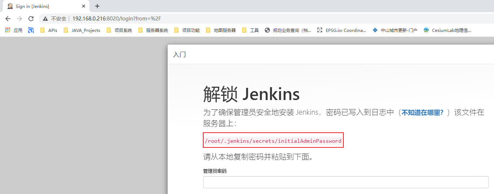

- 安装插件时，选择推荐插件进行安装

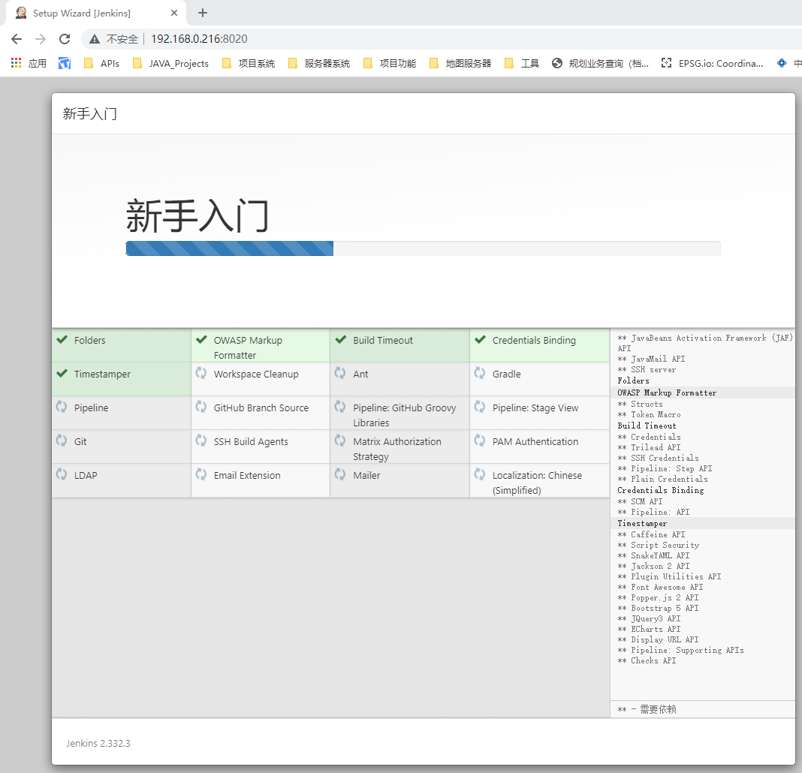

- 注册Jenkins管理员账户

- 集成插件安装（安装完成后，需要重启Jenkins。也可以在安装插件过程中，**勾选自动重启**）
  - **NodeJS Plugin**
  - **Subversion Plug-in**
  - **Maven Integration plugin**
  - **Publish Over SSH**

#### 全局配置（配置构建环境）

**构建集成环境可以使用本地环境，也可以使用Jenkins自主选择安装环境**

- Maven配置（本地环境；注意，有两处需要配置）

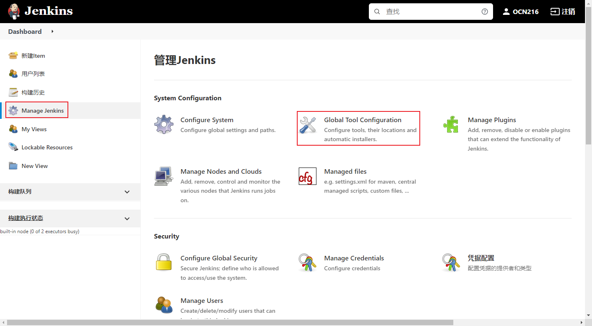

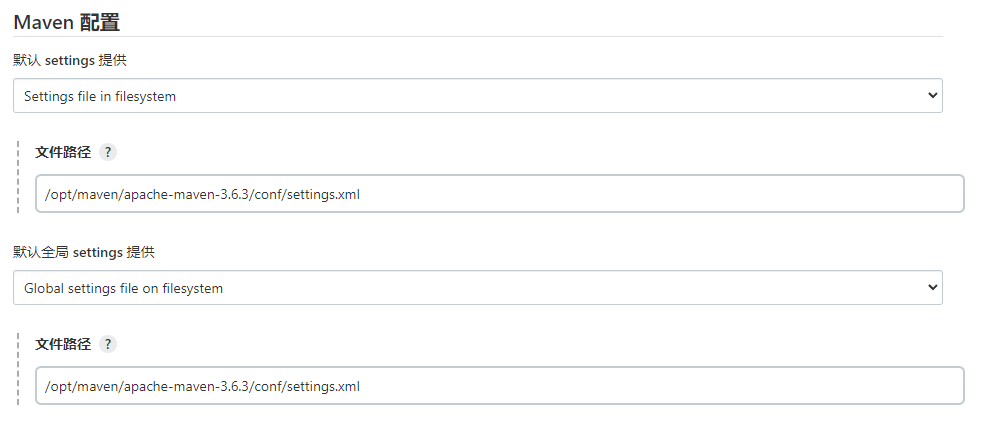

- JDK配置（本地环境）

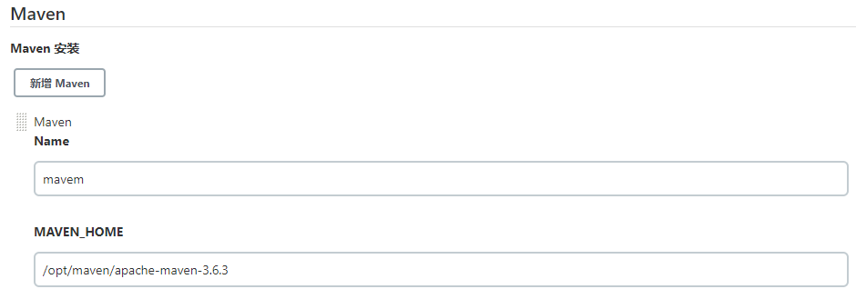

- NodeJS配置（本地环境；该配置项需要安装完NodeJS Plugin插件才会出现）

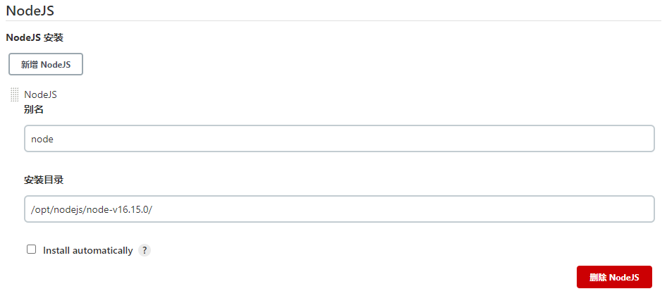

- 凭证配置（分`SVN`和`Git`配置）
  - 通用步骤（找到账号凭证配置）

    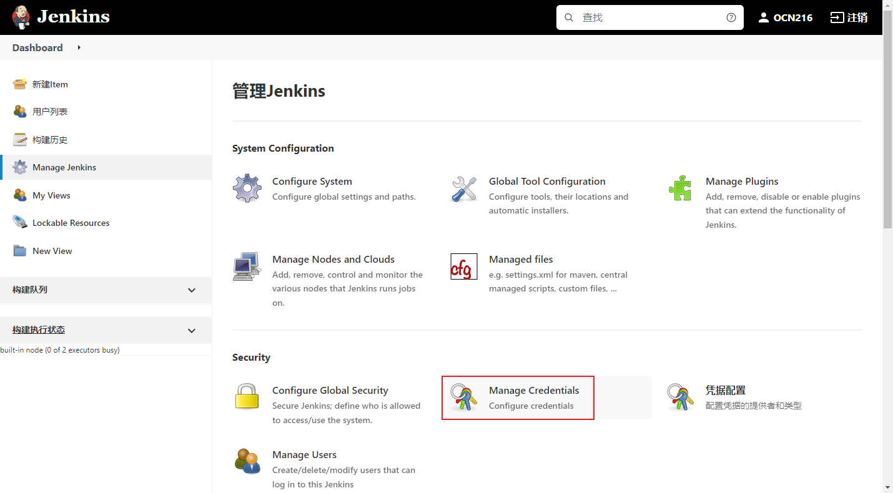
    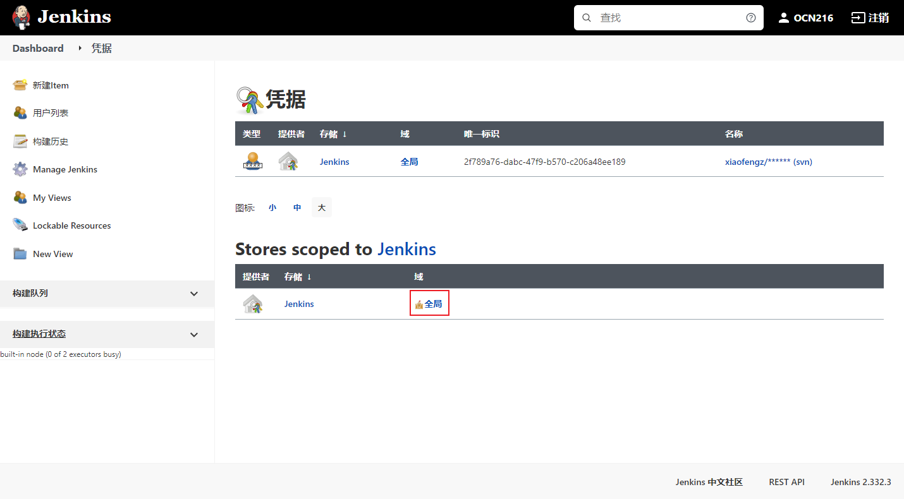
  - `SVN`

    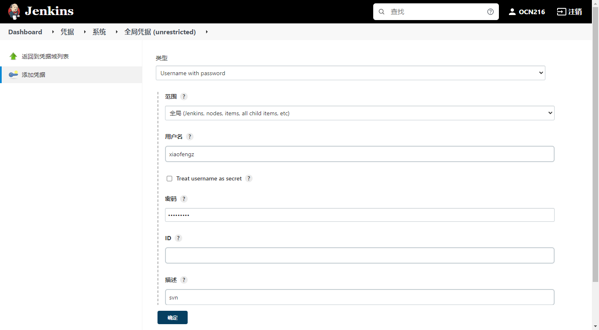
  - `Git`

    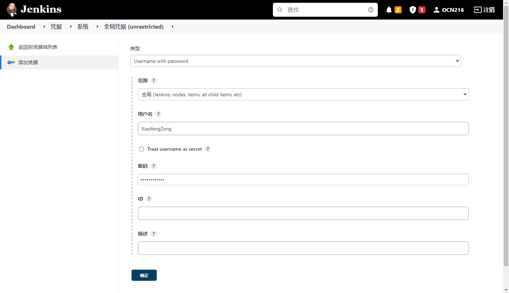

## 项目构建

在Jenkins中，存在视图和项目两个重要的概念。项目是一个个独立的构建项，而视图可以存放着许多构建项，即项目的容器。每个构建项中有许多配置项，如`源码管理`、`构建触发器`、`构建环境`、`构建预处理`，`构建后处理`等等操作

### 视图构建

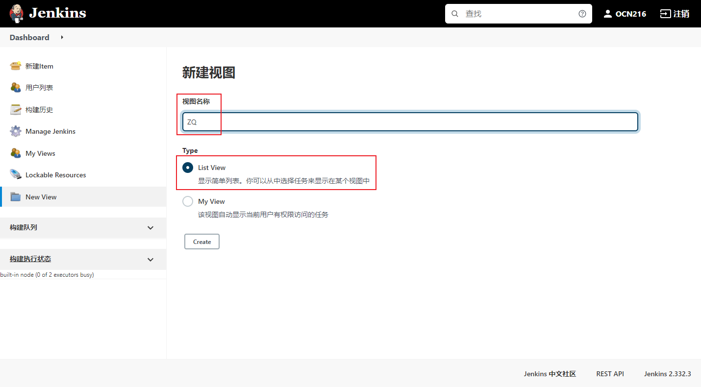
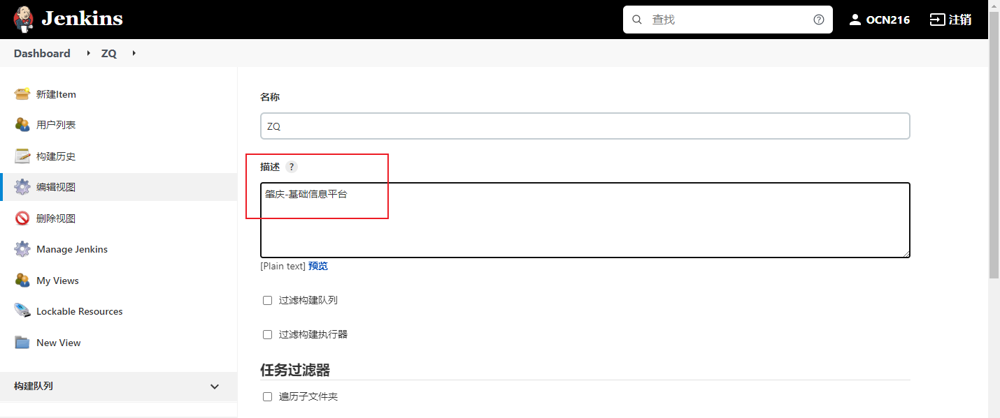

### 项目构建-通用操作

- 源码管理。填入源码地址+凭证
- 在【**构建触发器**】标签页中勾选`触发远程构建`、`Poll SCM`，`Build after orther projects are built`选项是构建情况而定（构建后端资源需要，构建前端资源不需要）
  - `触发远程构建`：可通过`<JENKINS_URL>/job/<ITEM_NAME>/build?token=<TOKEN>`的方式进行远程构建，不需要进入Jenkins管理界面
  - `Poll SCM`：计划构建，用于定时检查源码变更并构建

    ```sh
    # 该语句会输出上次一的构建时间以及下一次的将要构建的时间    
    H 1 * * *
    ```

### 后端项目构建

- 设置完通用操作后，在【**Build**】标签页中，设置`Goals and options`配置项
  - `clean install`：即先清理原有的再构建新的
  - `clean package -DskipTests`：即先清理原有的再打包，同时不执行测试用例

- 注意构建代码前后处理
  - 构建代码前处理：主要是判断该JAR包的端口是否存在，存在则杀死->[Shell脚本](../system/linux/sh.html#检查端口号并杀死对应进程)
  - 构建代码后处理：移动JAR包到指定目录，重启启动

    ```sh
    #!/bin/bash
    # 构建名称
    ITEM_NAME=my-jar
    # 目标存放目录
    TARGET_PATH=/home/jar

    # 复制JAR包到指定目录下，并统一名称
    cp /root/.jenkins/workspace/$ITEM_NAME/target/$ITEM_NAME-0.0.1-SNAPSHOT.jar $TARGET_PATH/$ITEM_NAME.jar
    # 启动JAR包，打印输出日志文件
    echo "start $ITEM_NAME"
    nohup java -jar $TARGET_PATH/$ITEM_NAME.jar > $TARGET_PATH/out/$ITEM_NAME.out 2>&1 &
    ```

### 前端项目构建

- 设置完通用操作后，1. 在【**构建环境**】勾选`Provide Node & npm bin/ folder to PATH` ，即使用先前在jenkins中配置好的node环境
- 在【构建】标签页中，添加执行Shell脚本
  - 构建代码后处理：移动构建后的文件夹到指定目录（一般是应用服务器[如`Tomcat`]的目录，具体由应用服务器的配置决定）

    ```sh
    #!/bin/bash
    # 构建名称
    ITEM_NAME=my-frontend
    # 前端工程名称
    PROJRCT_NAME=my-nest
    # 前端工程后名称
    PROJECT_ALIAS=nest
    # 静态目录
    STATIC_PATH=/home/nest
    # npm构建脚本
    BUILD_SCRIPT=build:$PROJECT_ALIAS
    #DATE=$(date +%Y%m%d%H%M%S)

    cd /root/.jenkins/workspace/$ITEM_NAME/$PROJRCT_NAME

    #TODO: 时间备份
    #mv $STATIC_PATH/$PROJECT_ALIAS $STATIC_PATH/$PROJECT_ALIAS/$DATE

    # 依赖安装+构建
    npm install
    npm run $BUILD_SCRIPT

    if [ $? -ne 0 ]; then
      exit 0
    else
      rm -rf $STATIC_PATH/$PROJECT_ALIAS
        #cp -r /root/.jenkins/workspace/$ITEM_NAME/$PROJRCT_NAME/$PROJECT_ALIAS $STATIC_PATH
        find ./$PROJECT_ALIAS | grep -vE "/.svn|/.git" | cpio -pdm $STATIC_PATH
    fi
    ```

### 构建后处理（可选）<sup>3</sup>

构建后处理比较常用的操作是文件传输+文件路径的改变+程序启动，需要用到先前安装的插件**Publish Over SSH**

#### 配置远程连接

前往【系统配置】，找到【Publish over SSH】配置项的【SSH Servers】小项

- 配置连接信息，保存即可

  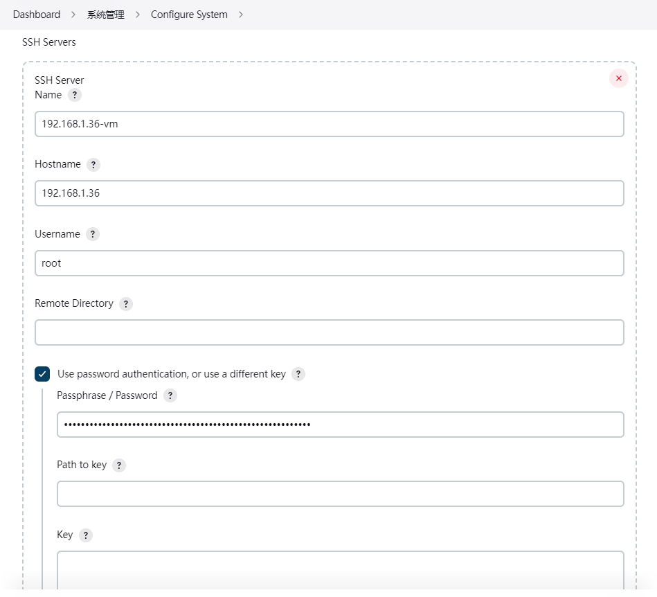

- 在构建项目中配置【构建后操作】操作
  - Source files：需要传输的文件/文件夹
  - Remove prefix：需要移除的目录前缀，基于Source files路径
  - Remote directory：远程的目录（默认为远程用户的目录，root -> /root）
  - Exec command：需要执行的操作

  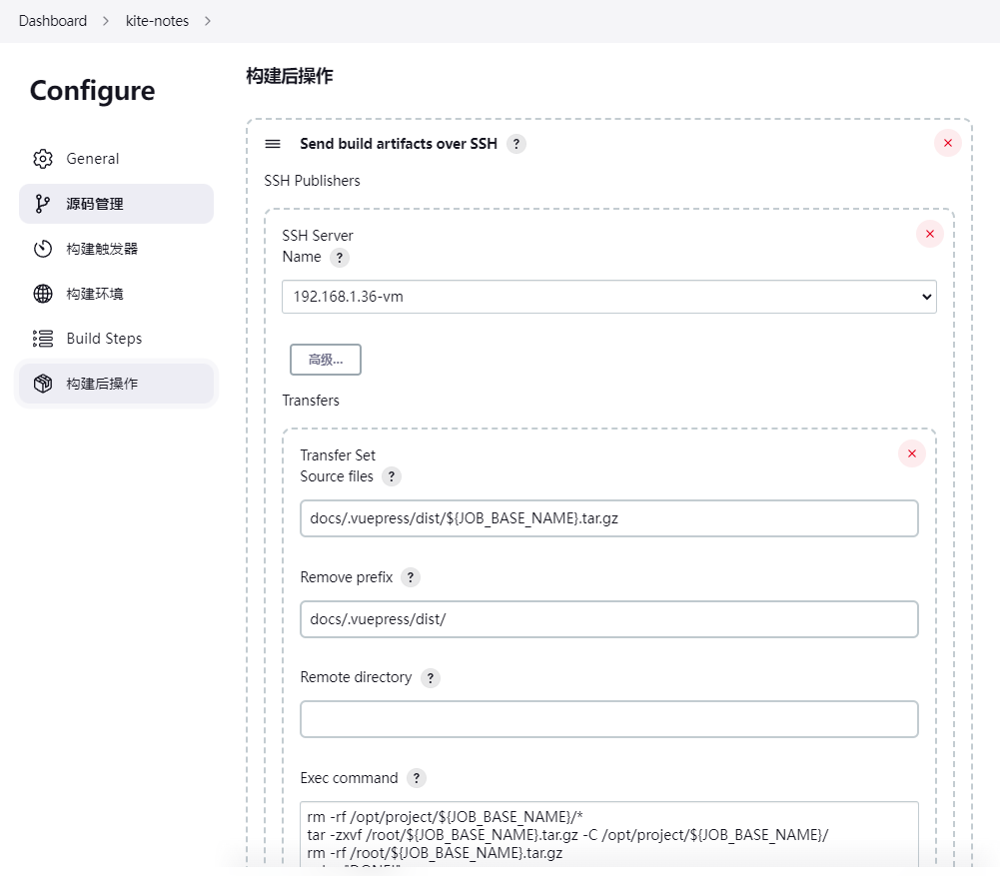

## 参考文档

1. [Jenkins中文文档-W3C School](https://www.w3cschool.cn/jenkins/)
2. [Docker安装Jenkins详细教程](https://blog.csdn.net/qq359605040/article/details/117692609)
3. [基于Docker安装Jenkins，并配置使用Jenkins打包Node前后端服务部署到远程服务器](https://juejin.cn/post/7067790095767568397#heading-16)
