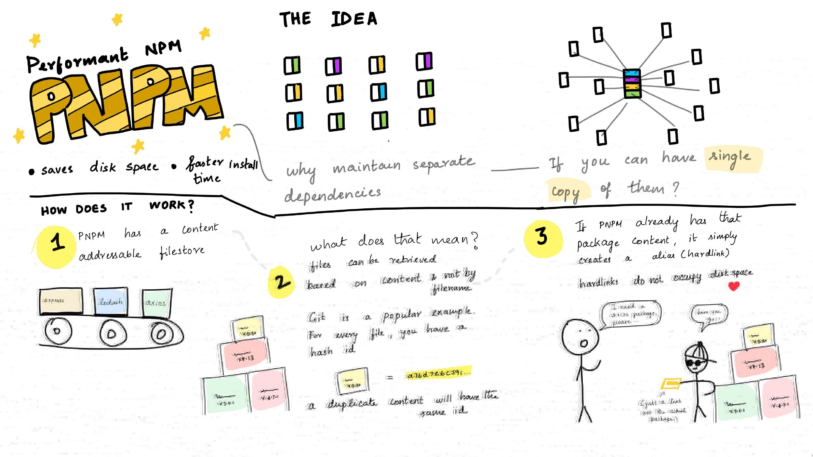
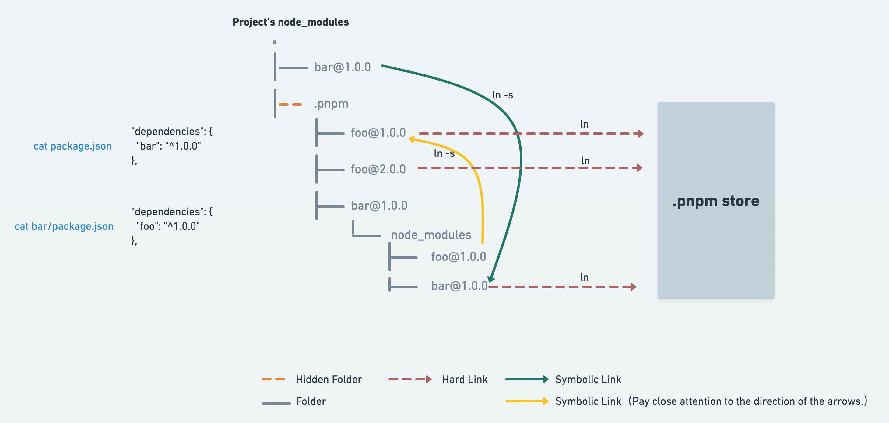

# pnpm

## 1. npmp简介

### 1.1 pnpm特点

- <mark>【无痛切换】</mark>与`npm`/`yarn`等主流包管理工具的使用类似，易于上手
- <mark>【节省磁盘空间并提升安装速度】</mark>采用`统一的包管理目录`对机器所安装的所有包进行管理
  - 项目需要依赖时首先会去该目录下检索，存在则复用，没有则新添加至统一包管理目录；
  - 如果是相同的依赖但不同版本时，只会检索该依赖下不同的依赖进行添加；

- <mark>【非扁平的 node_modules 目录】</mark>依赖使用`硬链接(hard-link)`和`符号链接(symbolic link)`进行相互关联
  - 在项目的`node_modules`目录中存在`.pnpm`目录，以及同级的、使用符号连接的依赖目录
  - `.pnpm`目录下面的部分依赖<u>硬链接</u>至`统一包管理目录`，而`.pnpm`目录同级的以来则是使用<u>符号链接</u>对依赖进行引用

- <mark>【多栖环境】</mark>pnpm可以不需要对node的环境有太多依赖，因为自身可以设置使用node的具体版本




### 1.2 pnpm与npm/yarn的区别(优势)<sup>1,2</sup>

- 相比`npm2` ，`pnpm`不会进行同样依赖的多次复制
- 相比`yarn`以及`npm3+`，不会有幽灵依赖（幽灵依赖是由于依赖声明丢失造成的）和，也不会有依赖分身（没有被提升的依赖依然复制多份）\

### 1.3 pnpm的弊端<sup>2</sup>

- 无法在不支持软连接的环境中使用`pnpm`，比如`Electron`应用
- 因为依赖安装在`统一的包管理目录`中的，调试依赖或使用`patch-package`给依赖打补丁不方便，可能会影响到其他项目

## 2. 安装与配置

- 安装

  ```sh
  # 安装（一般全局安装）
  npm install -g pnpm
  ```

- 配置
  - **node环境设置**

    pnpm支持在没有node(npm)的环境下进行[安装](https://www.pnpm.cn/installation)。安装完成后，可以使用`pnpm env`指令对node版本进行设置

    ```sh
    # 全局使用最新node版本
    pnpm env use --global lts
    # 全局使用具体node版本号的版本
    pnpm env use --global xx.xx.x
    # 全局使用预发布版本
    pnpm env use --global nightly
    pnpm env use --global rc
    pnpm env use --global 16.0.0-rc.0
    pnpm env use --global rc/14
    ```

  - **统一存储目录（内容寻址目录）**
    - 自动生成
    会自动在当前磁盘分区的根目录生成`.pnmp-store`目录
    - 手动生成

    ```sh
    pnpm config set store-dir {path}/.pnpm-store
    ```

  - **镜像**

    ```sh
    # 查看镜像
    pnpm config get registry 
    # 切换镜像（淘宝镜像）
    pnpm config set registry https://registry.npmmirror.com/
    ```

  - **环境变量（Path）+全局指令目录（global-bin-dir）**

    - 自动配置环境

      ```sh
      # 自动配置环境变量
      pnpm setup
      # 设置全局bin文件目录
      pnpm config set global-bin-dir {path}/.pnpm-global-bin-dir
      ```

    - 手动设置

      - Windows

        1. 设置变量：`PNPM_HOME`，变量值：`{path}/.pnpm-global-bin-dir`
        2. 变量该添加至Path中：`%PNPM_HOME%`
        3. 设置全局bin文件目录：

          ```sh
          pnpm config set global-bin-dir {path}/.pnpm-global-bin-dir
          ```

      - Linux

        `TODO...`

## 3. 常用 CLI 操作

  对项目/依赖的相关操作与`npm`/`yarn`类似

### 3.1 添加/移除/更新

  ```sh
  # []表示可替换选项，其中/分隔为选项可选
  # <pkg>表示相应的依赖包名称

  # 安装项目所有依赖
  pnpm install[i]

  # 安装-全局依赖(从全局环境中添加指定的软件包)
  pnpm add -g[--global] <pkg>
  # 安装-开发依赖(添加至devDependencies配置项)
  pnpm add -D[--save-dev] <pkg>
  # 安装-生产依赖(添加至dependencies配置项)
  pnpm add [-P/--save-prod] <pkg>

  # 删除-全局依赖(从全局环境中删除指定的软件包)
  pnpm remove[rm/uninstall/un] -g[--global] <pkg>
  # 删除-开发依赖(从devDependencies配置项中移除)
  pnpm remove[rm/uninstall/un] -D[--save-dev] <pkg>
  # 删除-生产依赖(从dependencies配置项中移除)
  pnpm remove[rm/uninstall/un] [-P/--save-prod] <pkg>

  # 更新-全局依赖
  pnpm update[up] -g[--global] <pkg>
  # 更新-开发依赖
  pnpm update[up] -D[--dev] <pkg>
  # 更新-生产依赖
  pnpm update[up] -P[--prod] <pkg>
  ```

### 3.2 清理

  删除不需要的软件包，<mark>**不建议经常执行该指令**</mark>

  ```sh
  pnpm prune
  ```

### 3.3 运行脚本

  ```sh
  # <script>是项目package.json中的script脚本

  pnpm run <script>
  pnpm <script> # 简写(前提是脚本与pnpm内建指令不冲突)
  ```

## 参考文档

1. [pnpm 是凭什么对 npm 和 yarn 降维打击的](https://mp.weixin.qq.com/s/sRKiqFNs24NYPxO4P5jq6Q)

2. [深入浅出 npm & yarn & pnpm 包管理机制](https://mp.weixin.qq.com/s/5YJYxvcqZIifQIsTR_I3fA)
