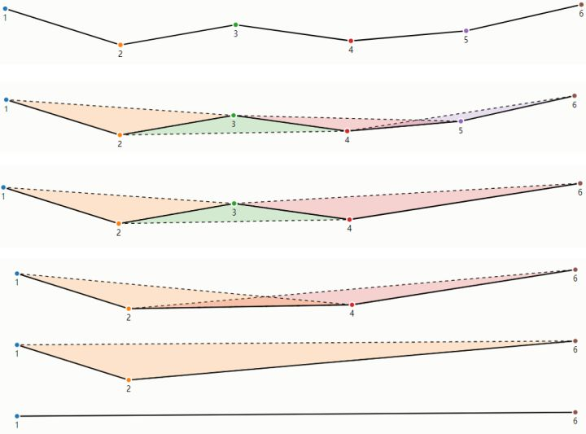

# 「算法」抽稀（概化）

## 背景/应用场景

随着对海量地理空间数据加载、渲染的需求日益增加。在地理信息系统中，对一些细节程度高的数据在地图上的展示往往需要绘制大量的坐标点，当地图缩放层级较小时，并不需要将所有的点都绘制出来，因为全部绘制出来往往会存在性能问题，因此，可通过**抽稀算法**，将不重要的点舍弃掉，那么系统对矢量数据加载的处理性能将得以提高，同时不影响视觉效果。

## 抽稀算法类型

抽稀，也称作概化。<u>抽稀算法的关键是定义**抽稀因子**，抽稀因子的不同决定了抽稀算法的多样性。在现有抽稀理论中，有按步长，线段长度，垂距等来定义抽稀因子。</u>1在GIS领域，比较常用的抽稀算法是**Ramer-Douglas-Peucker**算法（基于距离）和**Visvalingam-Whyatt**算法（基于面积）。

### Ramer-Douglas-Peucker（道格拉斯-普克）

从整体角度来考虑一条完整曲线或一段具体线段，思路为：

1. 确定距离阈值`D`，即抽稀因子，作为判断是否抽稀的指标
2. 对曲线的首末两点虚连一条直线，计算曲线每个点到虚直线的距离，找到最大距离`Dmax`，判断其距离与距离阈值`D`的关系
3. 如果`Dmax < D`，则舍弃该曲线的所有中间点，将虚直线作为抽稀后的线段
4. 如果`Dmax >= D`，则找到`Dmax`在曲线上的对应的点作为分割点将当前曲线分割为两段，继续对这两条线段进行`第2步`操作（即递归处理，直至所有`Dmax < D`，则处理完毕）

上图说明（可对应思路说明进行理解）：

- **黑色曲线**：表示抽稀前的曲线
- **浅蓝色直线**：表示虚直线
- **深蓝色直线**：表示抽稀后的曲线
- **最大值对应点（红色）**：表示`Dmax < D`，可以舍弃该曲线的所有中间点
- **最大值对应点（绿色）**：表示`Dmax >= D`，需要进行曲线分割并重新处理

### Visvalingam-Whyatt

是一种渐进式的抽稀方式，思路为：

1. 确定距离阈值`A`，即抽稀因子，作为判断是否抽稀的指标
2. 在一条曲线中，计算由三个连续的点所形成三角形面积，找到这些三角中的最小面积`Amin`，判断其面积与面积阈值`A`的关系
3. 如果`Amin < A`，则删除该面积对应三角形中的中间顶点，继续对剩下的顶点所形成的曲线进行`第2步`操作（即递归处理，直至所有`Amin > A`，则处理完毕）

### Ramer-Douglas-Peucker和Visvalingam-Whyatt的算法区别

1. `Ramer-Douglas-Peucker`算法的优点是计算简单，但它的结果可能会出现自相交
2. `Ramer-Douglas-Peucker`计算效率更高，它的时间复杂度是`O(n^2)`，`Visvalingam-Whyatt`的时间复杂度是`O(n·log(n))`。
3. `Ramer-Douglas-Peucker`算法的阈值是距离，`Visvalingam-Whyatt`算法的阈值是面积
4. 相比起`Ramer-Douglas-Peucker`算法的选取保留点，`Visvalingam-Whyatt`算法是选取删除点
5. 相比起`Ramer-Douglas-Peucker`算法，`Visvalingam-Whyatt`算法产生的角度变化更小，更能保留几何面的特征，更加适用于河流、森林或海岸线等自然线条或多边形特征的抽稀

## 拓扑问题

概化数据可能会破坏数据的拓扑关系，因此，可以先将数据转化为拓扑结构，再对拓扑数据进行数据概化（抽稀）

## 实现

### 已有实现

1. [mapshaper -simlpify](https://mapshaper.org/)
2. [Simply.js](http://mourner.github.io/simplify-js/)
3. [OpenpLayers —— ol/geom/Geometry -> simplify(tolerance)](https://openlayers.org/en/latest/apidoc/module-ol_geom_Geometry-Geometry.html#simplify)
4. QGIS —— MenuBar -> Vector -> Geometry Tools -> Simplify
5. QGIS —— ToolBox-> GRass -> Vector -> v.generalize

## 参考文档

1. [抽稀-百度百科](https://baike.baidu.com/item/%E6%8A%BD%E7%A8%80/7297123)

2. [空间数据量大怎么办，三种方式告诉你怎么抽稀](https://mp.weixin.qq.com/s/dbt8ZNFJ7TuVoGX5u1xWmw)

3. [常用的地图数据概化算法：Douglas-Peucker与Visvalingam-Whyatt](https://zhuanlan.zhihu.com/p/355323735)

4. [Description of Visvalingam & Whyatt Line Simplification Algorithm](https://ignf.github.io/CartAGen/docs/algorithms/line/visvalingam.html)
