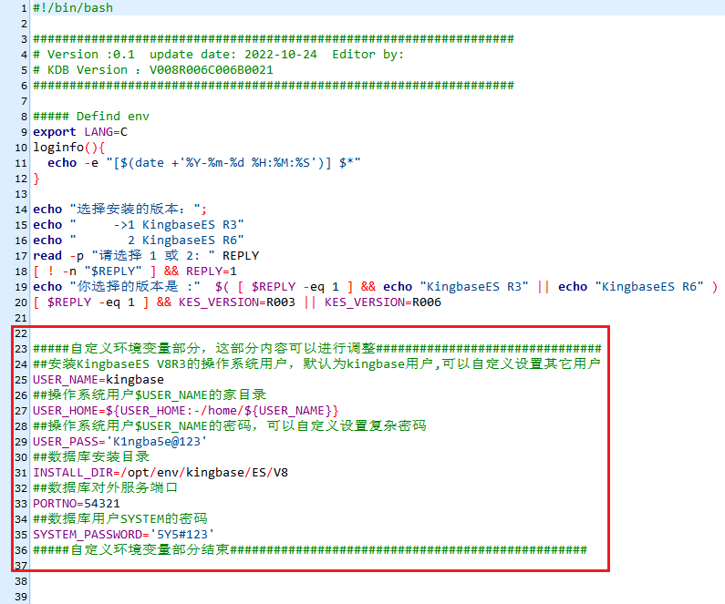
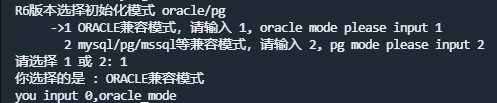
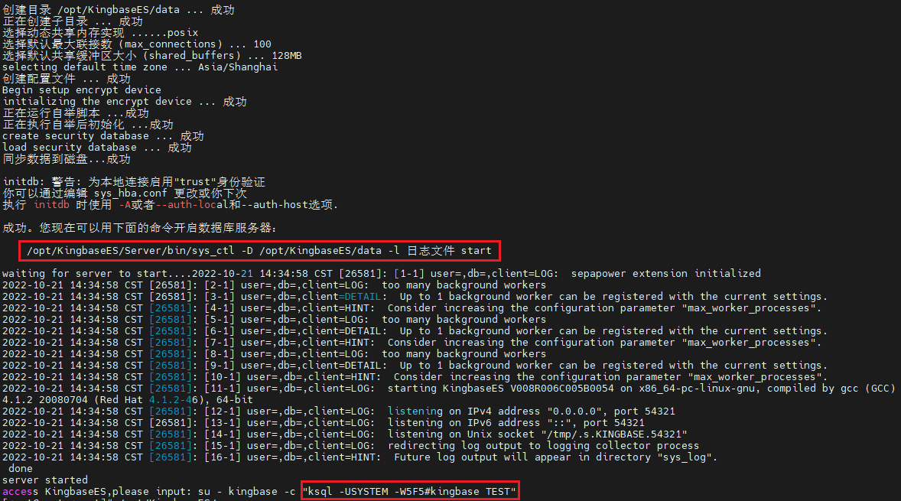
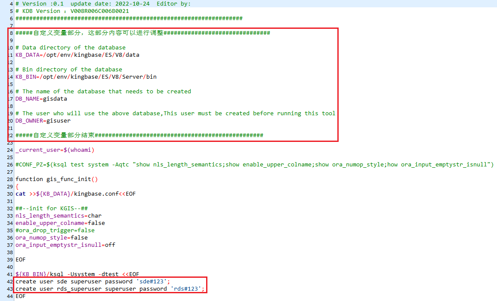
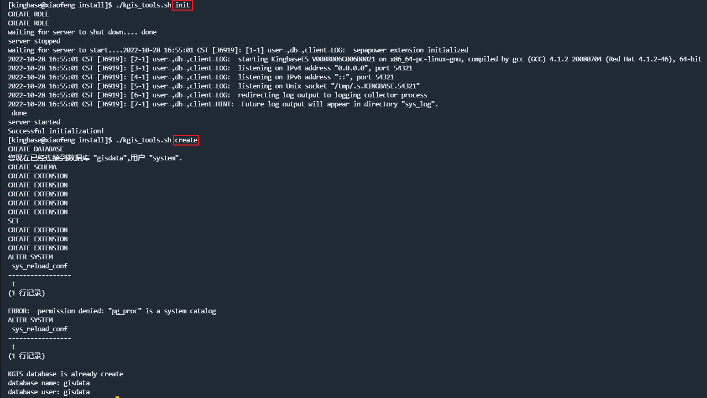

# Kingbase（人大金仓数据库）

## 安装

### 检查安装前的基础环境

执行kdb_check.sh脚本，检查安装前的系统环境，在安装前将所需工具/配置进行调整，用于后续执行人大金仓安装

```sh
bash kdb_check.sh
```

### 命令行交互安装

在安装人大金仓安装之前，修改kdb_install.sh脚本的自定义配置，也可以选择默认安装

```sh
vim kdb_install.sh
```



执行kdb_install.sh脚本，安装人大金仓安装主程序

```sh
bash kdb_install.sh
```

安装过程的选择：

1. 版本选择：R6

    
2. 兼容模式：Orcale兼容

    
3. 大小写敏感：敏感

    

安装完成后，会提供将来启动人大金仓服务的指令，并立即启动人大金仓服务



## 创建数据库

### 空间数据库

需要先创建空间数据库用户，再创建空间数据库、空间数据库引擎和插件拓展

```sh
ksql -U SYSTEM -W 5Y5#123 -d TEST

CREATE DATABASE gisdata;
create user gisdata with password 'gisdata#123';
```

配置kgis_tools.sh脚本



执行脚本kgis_tools.sh

```sh
su kingbase

cd ${SH_PATH}

./kgis_tools.sh init
./kgis_tools.sh create
```



注：上图ERROR错误，根据人大金仓技术支持反馈，可能是当时这一步没有重新加载配置文件成功导致的，因此可以尝试单独执行该操作。

```sh
su kingbase

ksql -U SYSTEM -W 5Y5#123 -d gisdata

alter system set allow_system_table_dml = on;
select sys_reload_conf();
update pg_proc set proisstrict=false where proname ilike '%addgeo%' and proargtypes='1043 1043 1043 1043 23 1043 23 16';
alter system set allow_system_table_dml = off;
select sys_reload_conf();
```

## 参考文档
