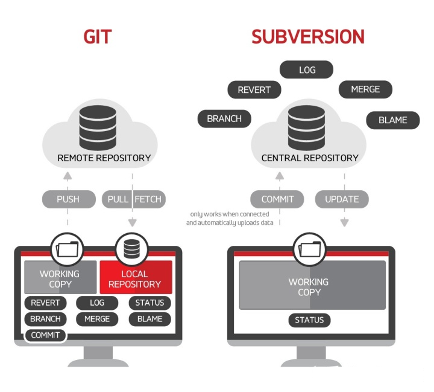
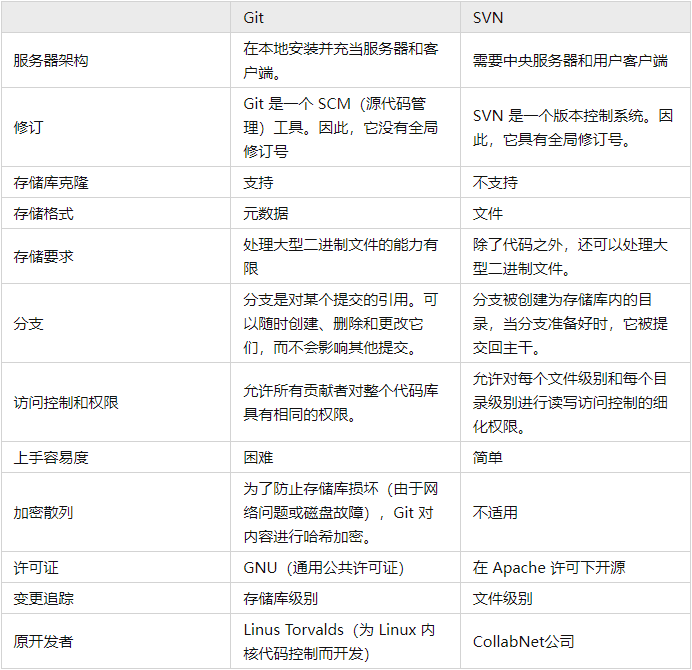
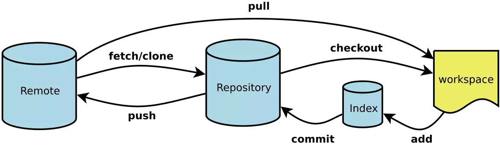

# Git

> Git is a free and open source distributed version control system designed
> to handle everything from small to very large projects with speed and efficiency.
> —— Git是一个免费的开源分布式版本控制系统，可以快速高aaa效地处理从小到大的所有项目。

`Git`是[Linus Torvalds](https://baike.baidu.com/item/林纳斯·本纳第克特·托瓦兹/1034429)为了帮助管理Linux内核开发而开发的一个开放源码的版本控制软件

## Git vs. SVN



### 联系与区别

1. **核心架构不同**（**最核心的区别**）：`Git`是**分布式**的版本控制系统，而`SVN`是**集中式**的，因此，`Git`支持离线工作，`SVN`必须联网才能工作
2. **概念和指令不同**：`SVN`概念和指令较少，上手容易，而`Git`概念多且复杂，如`add`、`commit`、`push`、`fetch`、`pull`等等，概念多但也意味着功能更加强大
3. **分支管理不同**：`Git`可以有本地分支，且分支的指针指向的某次提交，而`SVN`没有本地分支，它的分支只是一个拷贝的目录。
  因此，`Git`分支创建和切换十分便捷，并且在开发过程中遇到突发事情需要另外处理时，使用`Git`的`stash`将当前改动临时存储，使得分支管理更加灵活



## 安装与配置

### 安装

前往[Git](https://git-scm.com/)官网下载安装包，默认安装即可

### 配置(SSH)

- 修改本地配置config

  ```sh
  # 设置全局用户名称
  git config --global user.name <username>
  # 设置全局用户邮箱
  git config --global user.email <email>
  ```

- 打开`Git Bash`，生成rsa文件，以及ssh

  ```sh
  # 生成新的ssh
  # <email>: 电子邮箱
  #-t: 密钥类型, 可以选择 dsa | ecdsa | ed25519 | rsa;
  #-b: 指定密钥长度
  #-f: 密钥目录位置, 默认为当前用户home路径下的.ssh隐藏目录, 也就是~/.ssh/, 同时默认密钥文件名以id_rsa开头. 如果是root用户, 则在/root/.ssh/id_rsa, 若为其他用户, 则在/home/<username>/.ssh/id_rsa;
  #-C: 指定此密钥的备注信息, 需要配置多个免密登录时, 建议携带;
  ssh-keygen -t rsa -b 4096 -C "<email>"

  # 按回车三次
  # 查看生成的文件，并复制至Github上
  cat ~/.ssh/id_rsa.pub
  ```

- 在Github上创建ssh key
  - 找到并打开`Settings`，找到`SSH adn GPG keys`项(<https://github.com/settings/keys>)
  - 点击`New SSH key`，将复制的内容粘贴至`Key`文本框，并设置好`Title`
  - 保存，即`Add SSH key`

- 检查是否能够通过SSH与GitHub通信
  - 如果出现`Hi xxx! You've successfully authenticated, but GitHub does not provide shell access.`，说明配置成功；
  - 如果出现`Permission denied (publickey).`，说明配置失败，需要重新操作。

  ```sh
  # -T: 禁止分配伪终端
  ssh -T git@github.com
  # 若有提示则输入yes
  ```

## 基本使用

### 基本概念



- **Workspace**：工作区，就是计算机上的一个目录。开发者日常主要的开发工作都在这完成
  - 基于开发分支`develop`创建的特性分支`feature/xxx`，进行功能模块开发\
  - 基于开发分支`develop`创建的版本分支`release/x.x.x`，进行版本的发布说明
  - 基于主分支`main`的热修复分支`hotfix/xxx`，对上线的产品进行快速修复
  - 等等...
- **Respository**：本地版本库，也称为本地仓库。在这既可以与工作空间的状态进行管理（主要是对分支的管理操作）：切换本地分支、本地版本库与远程版本库的改动推送/拉取
- **Remote**: 远程版本库，也称为远程仓库。用于存储各种正式代码分支，与本地版本库进行相关操作
  - 主分支`main`
  - 开发分支`develop`
  - 等等...
- **Index**：暂存区，类似缓存的地方，临时保存修改内容: 比如新增改动、提交改动、暂存/恢复先前修改。每次操作后生成的索引值（基于`SHA-1算法`生成的哈希值），一般只需要确认其前3~4位就能够找到对应的改动记录。

### 工作区(Workspace)管理

- 提交

  ```sh
  # 查看状态
  git status

  # 添加所有改动文件到暂存区
  git add .
  # 添加指定的改动文件到暂存区
  git add <file>
  # 提交暂存区代码至当前分支，需要填写改动信息
  git commit -m "<message>"
  ```

- 合并（merge/rebase）、

  1. `merge`用将指定分支与当前分支进行合并
  2. `rebase`用于将分支的提交更加“线性”，即将某一分支中的最后一个提交备份作为目标分支的下一次提交，并且将该分支的记录抹除，达到“线性”提交的效果。`-i`即`--interactive`，交互模式，能够修改版本提交的顺序。

  ```sh
  # 将<target>合并至当前分支
  git merge <target>

  # 将当前分支合并至<target>，如果传入<branch>，则会合并将HEAD指向<branch>
  git rebase [-i|--interactive] <target> [<branch>]
  ```

### 版本库(Repository)管理

#### 本地版本库(Local)管理

- 拉取
  
  主要有两种方式：`fetch`和`pull`，
  
  1. `fetch`：拉取远程仓库代码到新分支，不合并当前分支的改动，需要手动merge，因此`fetch`后常与`merge`配合使用
  2. `pull`：拉去远程代码到本地，并自动合并当前改动
  
  ```sh
  # fetch + merge
  git fetch [origin <remote>[:<local>]]
  git merge <remote>

  # pull
  git pull [origin <remote>:<local>]
  ```

- 推送

  ```sh
  # 推送提交代码至远程仓库
  git push
  ```

- 创建/切换分支

  创建本地分支可用`branch`，
  切换本地分支用的HEAD指向可用`switch`或`checkout`，
  **`checkout`不仅能用于创建分支，还可以切换分支。**

  ```sh
  # 创建【本地】分支
  git branch <local>
  # 切换【本地】分支
  git switch <local>
  # 创建并切换【本地】分支
  git checkout -b <local>
  ```

- 删除分支

  删除分支主要使用`branch`和参数`-d/-D`控制

  1. `-d`：常规删除
  2. `-D`：强制删除，相当于`--delete --force`

  ```sh
  # 删除【本地】分支
  # 常规删除
  git branch -d <local>
  # 强制删除
  git branch -D <local>
  ```

#### 远程版本库(Remote)管理

- 创建分支

  ```sh
  # 创建并切换分支
  git push orign <local>:<remote>
  ```

- 删除分支

  ```sh
  # 删除【远程】分支
  # 常规删除
  git push origin -d <remote>
  # 强制删除
  git push origin -D <remote>
  # 推送空分支
  git push origin :<remote>
  ```

- 跟踪分支

  ```sh
  # 当存在本地分支，想远程创建同名分支+跟踪
  git push origin [-u|--set-upstream] <local>
  # 当远程存在分支，想本地创建同名分支+跟踪
  git checkout --track origin/<remote>
  ```

### 暂存区(Index)管理

## 进阶使用

### Git Hook

钩子

## 团队协作流程


目前主流的Git团队协作开发主要用主分支`master|main`和开发分支`develop`来记录开发历史，而开发者的所有开发活动都基于开发分支上进行。

- `master`：主分支，也可以命名为`main`（`main`的命名是因为BLM运动而出现），这是仓库最主要、最稳定的代码版本，一般只有管理员有写入权限，用于保存发布版本历史，顺便打标签。
- `develop`：开发分支，一般各种开发活动最终需要集成到该分支。后续考虑代码版本发布时，会基于该分支检出一个发布分支并进行版本发布
- `feature`：功能开发分支，命名一般为`feature/xxx`。基于`develop`分支检出（相当于父分支为`develop`），开发完成后需要合并至`develop`，一般会出现冲突，需要处理完冲突再进行合并。
- `hotfix`：紧急修复分支，命名一般为`hotfix/xxx`，唯一可以基于`master`分支检出的分支，修复完后需要合并回`master`和`develop`分支，并且在`master`打好标签。
- `release`：发布分支，用于向外发布指定版本。

### 传统协作流

```sh
# 一般来说，远程仓库会优先创建好develop分支，用于日常开发。
# 开发者只需要基于develop分支创建feature分支进行开发，可选择性地在远程中创建跟踪分支
git checkout -b feature/xxx develop
git push -u origin feature/xxx 

# 开发完成后，需要合并至develop分支（可能会出现冲突，出现则需要解决）。

# 1. 先在本地仓库提交修改
git add -A
git commit -m "feat:xxx"

# 2. 更新远程develop分支
git pull origin develop

# 3. 合并feat分支至本地develop分支（可能需要处理冲突）
git checkout develop
git merge --no-ff feature/xxx

# 4. 推送至远程develop分支
git push origin develop

# 5. 删除本地和远程分支
git branch -d feature/xxx
git push origin -d feature/xxx
```

### 高效协作流：Git Flow

在Git中，简单地封装了一个指令`git flow`，用于创建标准的工作流，如果熟悉Git的工作流，可以完全不需要这个指令。这个指令可以让我们更方便地进行工作流管理。


```sh
# 初始化Git工作流，主要是配置master、develop、feature、relase、hotfix等分支
git flow init [-d | -f]

# 开始新Feature的开发工作 
git flow feature start <NAME>

# 发布Feature分支，相当于push至远程开发分支
git flow feature publish <NAME>

# 从远程仓库获取发布的Feature
git flow feature pull origin <NAME>

# 完成并关闭Feature分支
git flow feature finish <NAME>

# 开始一个Release分支
git flow release start <RELEASE> [BASE]
# 发布一个Release
git flow release publish <RELEASE>
# 结束Release
git flow release finish <RELEASE>
# 给主分支打标签
git push --tags

# 开始一个Hotfix
git flow hotfix start <VERSION> [BASENAME]
# 结束一个Hotfix
git flow hotfix finish <VERSION>
```

### 代码提交规范

#### 主流的规范

```sh
<type>(<scope>): <subject>

<body>

<footer>
```

使用主流的Angular代码提交规范（如上代码块），主要分为三个部分:

1. **Header（标题行）**：必填，描述主要**修改类型**和**内容**

    - **type**：commit类型

      ```sh
      feat: 新功能、新特性
      fix: 修改bug
      perf: 更改代码，性能优化
      refactor: 代码重构（重构，在不影响代码内部行为、功能下的代码修改）
      docs: 文档修改
      style: 代码格式修改, 注意不是 css 修改（例如分号修改）
      test: 测试用例新增、修改
      build: 影响项目构建或依赖项修改
      revert: 恢复上一次提交
      ci: 持续集成相关文件修改
      chore: 其他修改（不在上述类型中的修改）
      release: 发布新版本
      workflow: 工作流相关文件修改
      ```

    - **scope**：说明commit影响的范围

      说明commit影响的范围，如global, common, route, component, utils, build...

    - **subject**：commit的简要说明

      简要说明commit的内容
  
2. **Body（主题内容）**：详细描述做了什么样的修改，为什么修改，以及开发的思路...
3. **Footer（页脚注释）**：可以写注释，引用Issues...

#### 提交信息检测配置(husky+commmitizen+commitlint)

工具:

- `husky`：主流Git Hook工具，Vue工程集成的是`yorkie`
- `commitizen`：Git Commit Message规范工具
- `cz-conventional-changelog`：传统日志
- `cz-customizable`：自定义提交日志，需要配置
- `@commitlint/config-conventional`：检测Git提交
- `@commitlint/cli`：检测Git提交脚手架

#### 前置安装

```sh
# git hook工具
npm i husky -D
npx husky-init
```

#### 预提交配置

1. 自动生成提交内容

    安装相关工具

    ```sh
    # 规范 commit message 的工具
    npm i -g commitizen
    # 使用传统commit规范提示
    npx commitizen init cz-conventional-changelog --save-dev
    # 传统commit规范package.json配置
    "config": {
      "commitizen": {
        "path": "./node_modules/cz-conventional-changelog"
      }
    }

    # （可选）使用自定义的commit规范提示，同时需要在根目录下新建.cz-config.js文件
    npm i cz-customizable --save-dev
    # 传统commit规范package.json配置
    "config": {
      "commitizen": {
        "path": "./node_modules/cz-customizable"
      }
    }
    ```

2. 配置自定义提交`.cz-config.js`文件

    ```js
    module.exports = {
      // 可选类型
      types: [
        { value: "feat", name: "feat:     新功能" },
        { value: "fix", name: "fix:      修复" },
        { value: "docs", name: "docs:     文档变更" },
        { value: "style", name: "style:    代码格式(不影响代码运行的变动)" },
        {
          value: "refactor",
          name: "refactor: 重构(既不是增加feature，也不是修复bug)",
        },
        { value: "perf", name: "perf:     性能优化" },
        { value: "test", name: "test:     增加测试" },
        { value: "chore", name: "chore:    构建过程或辅助工具的变动" },
        { value: "revert", name: "revert:   回退" },
        { value: "build", name: "build:    打包" },
      ],
      // 消息步骤
      messages: {
        type: "请选择提交类型:",
        customScope: "请输入修改范围(可选):",
        subject: "请简要描述提交(必填):",
        body: "请输入详细描述(可选):",
        footer: "请输入要关闭的issue(可选):",
        confirmCommit: "确认使用以上信息提交？(y/n/e/h)",
      },
      // 跳过问题
      skipQuestions: ["body", "footer"],
      subjectLimit: 72, // subject文字长度默认是72
    };
    ```

3. 指令替换

    配置完成后，提交信息则使用`git cz`替代`git commit -m`

#### 提交信息检测

1. 安装相关工具

    ```sh
    # 检测 commit message 的工具
    npm i @commitlint/config-conventional @commitlint/cli -D
    # 在根目录下新建创建commitlint.config.js文件+添加配置
    "config": {
      "commitizen": {
        "path": "./node_modules/cz-conventional-changelog"
      }
    }
    # 创建commit-msg钩子
    npx husky add .husky/commit-msg
    # .husky/commit-msg文件添加
    npx --no-install commitlint --edit $1
    ```

2. 配置`commitlint.config.js`文件

    ```js
    module.exports = {
      extends: ["@commitlint/config-conventional"],
      rules: {
        "type-enum": [2, "always", ["upd", "feat", "fix", "refactor", "docs", "chore", "style", "revert"]],
        "type-case": [0],
        "type-empty": [0],
        "scope-empty": [0],
        "scope-case": [0],
        "subject-full-stop": [0, "never"],
        "subject-case": [0, "never"],
        "header-max-length": [0, "always", 72],
      },
    };
    ```

## 工具

- **独立软件**
  - [SourceTree](https://www.sourcetreeapp.com/)
- **IDE插件**
  - [GitLens](https://www.gitkraken.com/gitlens)
- **NPM依赖**
  - [husky](https://www.npmjs.com/package/husky)：Git Hook工具
  - [commitizen](https://www.npmjs.com/package/commitizen)：提交前交互生成message工具
  - [cz-customizable](https://www.npmjs.com/package/cz-customizable)：提交前交互提示自定义工具
  - commitlint
    - [@commitlint/cli](https://www.npmjs.com/package/@commitlint/cli)：提交前message规范检测工具
    - [@commitlint/config-conventional](https://www.npmjs.com/package/@commitlint/config-conventional)：提交前message自定义规范工具

## 学习/练手资源

[Learn Git Branching](https://learngitbranching.js.org/?locale=zh_CN)

## 参考文档

1. [git flow的使用](https://www.cnblogs.com/lcngu/p/5770288.html)
2. [对比Git与SVN，这篇讲的很易懂](https://zhuanlan.zhihu.com/p/48148269)
