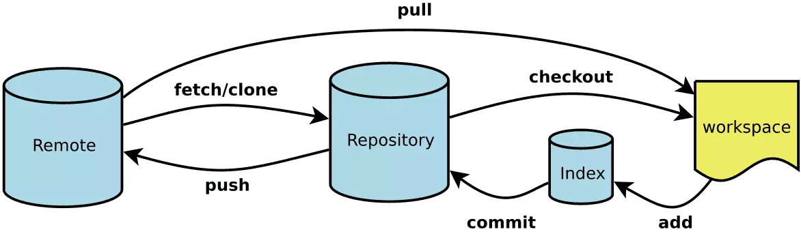

# Git

> Git is a free and open source distributed version control system designed to handle everything from small to very large projects with speed and efficiency. —— Git是一个免费的开源分布式版本控制系统，可以快速高效地处理从小到大的所有项目。

`Git`是[Linus Torvalds](https://baike.baidu.com/item/林纳斯·本纳第克特·托瓦兹/1034429)为了帮助管理Linux内核开发而开发的一个开放源码的版本控制软件

## Git的特点优势

1. 分布式。每一部机器都有一个完整的版本库。
2. 良好的分支策略。鼓励多使用分支管理。

## Git与SVN（Subversion）的联系和区别

1. `Git`是分布式的版本控制系统，而`SVN`不是：**最核心的区别**。
2. `Git`把内容按元数据方式存储，而`SVN`是按文件：所有的资源控制系统都是把文件的元信息隐藏在一个类似 .svn、.cvs 等的文件夹里。
3. `Git`分支和`SVN`的分支不同：分支在SVN中一点都不特别，其实它就是版本库中的另外一个目录。
4. `Git`没有一个全局的版本号，而`SVN`有：目前为止这是跟 SVN 相比 Git 缺少的最大的一个特征。
5. `Git`的内容完整性要优于`SVN`：Git的内容存储使用的是SHA-1哈希算法。这能确保代码内容的完整性，确保在遇到磁盘故障和网络问题时降低对版本库的破坏。

## 安装配置

前往[Git](https://git-scm.com/)官网下载安装包，默认安装即可

### 配置（与Github关联）

- 修改本地配置config

  ```sh
  # 设置全局用户名称
  git config --global user.name <username>
  # 设置全局用户邮箱
  git config --global user.email <email>
  ```

- 打开`Git Bash`，生成rsa文件，以及ssh

  ```sh
  # 生成新的ssh
  # <email>: 电子邮箱
  ssh-keygen -t rsa -b 4096 -C "<email>"
  # 按回车三次
  # 查看生成的文件，并复制至Github上
  cat ~/.ssh/id_rsa.pub
  ```

- 在Github上创建ssh key
  - 找到并打开`Settings`，找到`SSH adn GPG keys`项(https://github.com/settings/keys)
  - 点击`New SSH key`，将复制的内容粘贴至`Key`文本框，并设置好`Title`
  - 保存，即`Add SSH key`

- 检查是否能够通过SSH与GitHub通信
  - 如果出现`Hi xxx! You've successfully authenticated, but GitHub does not provide shell access.`，说明配置成功；
  - 如果出现`Permission denied (publickey).`，说明配置失败，需要重新操作。

  ```sh
  ssh -T git@github.com
  # 若有提示则输入yes
  ```

## 工作流



- Remote: 远程仓库，用于存储正式代码、进行版本发布等操作...
- Respository：本地仓库，具有**分布式特点**，每个机器都能够有独立的版本库。
- workspace：工作空间，开发者日常主要的开发工作都在这完成

## 常用命令

  占位符说明
  
  1. local: 表示本地分支名称
  2. remote: 表示远程分支名称

### 代码管理

- 拉取
  
  主要有两种方式：`fetch`和`pull`，
  
  1. `fetch`：拉取远程仓库代码到新分支，不合并当前分支的改动，需要手动merge，因此`fetch`后常与`merge`配合使用
  2. `pull`：拉去远程代码到本地，并自动合并当前改动
  
  ```sh
  # fetch + merge
  git fetch [origin <remote>[:<local>]]
  git merge <remote>

  # pull
  git pull [origin <remote>:<local>]
  ```

- 提交

  ```sh
  # 查看状态
  git status

  # 添加所有改动文件到暂存区
  git add .
  # 添加指定的改动文件到暂存区
  git add <file>
  # 提交暂存区代码至当前分支，需要填写改动信息
  git commit -m "<message>"
  ```

- 推送

  ```sh
  # 推送提交代码至远程仓库
  git push
  ```

- 合并（merge/rebase）、

  1. `merge`用将指定分支与当前分支进行合并
  2. `rebase`用于将分支的提交更加“线性”，即将某一分支中的最后一个提交备份作为目标分支的下一次提交，并且将该分支的记录抹除，达到“线性”提交的效果。`-i`即`--interactive`，交互模式，能够修改版本提交的顺序。

  ```sh
  # 将<target>合并至当前分支
  git merge <target>

  # 将当前分支合并至<target>，如果传入<branch>，则会合并将HEAD指向<branch>
  git rebase [-i|--interactive] <target> [<branch>]
  ```

### 本地分支管理

- 创建/切换分支

  创建本地分支可用`branch`，
  切换本地分支用的HEAD指向可用`switch`或`checkout`，
  **`checkout`不仅能用于创建分支，还可以切换分支。**

  ```sh
  # 创建【本地】分支
  git branch <local>
  # 切换【本地】分支
  git switch <local>
  # 创建并切换【本地】分支
  git checkout -b <local>
  ```

- 删除分支

  删除分支主要使用`branch`和参数`-d/-D`控制

  1. `-d`：常规删除
  2. `-D`：强制删除，相当于`--delete --force`

  ```sh
  # 删除【本地】分支
  # 常规删除
  git branch -d <local>
  # 强制删除
  git branch -D <local>
  ```

### 远程分支管理

- 创建分支

  ```sh
  # 创建并切换分支
  git push orign <local>:<remote>
  ```

- 删除分支

  ```sh
  # 删除【远程】分支
  # 常规删除
  git push origin -d <remote>
  # 强制删除
  git push origin -D <remote>
  # 推送空分支
  git push origin :<remote>
  ```

- 跟踪分支

  ```sh
  # 当存在本地分支，想远程创建同名分支+跟踪
  git push origin [-u|--set-upstream] <local>
  # 当远程存在分支，想本地创建同名分支+跟踪
  git checkout --track origin/<remote>
  ```

## 代码提交规范

```sh
<type>(<scope>): <subject>

<body>

<footer>
```

使用主流的Angular代码提交规范（如上代码块），主要分为三个部分:

1. Header（标题行）：必填，描述主要**修改类型**和**内容**

    - type：commit类型

      ```sh
      feat: 新功能、新特性
      fix: 修改bug
      perf: 更改代码，性能优化
      refactor: 代码重构（重构，在不影响代码内部行为、功能下的代码修改）
      docs: 文档修改
      style: 代码格式修改, 注意不是 css 修改（例如分号修改）
      test: 测试用例新增、修改
      build: 影响项目构建或依赖项修改
      revert: 恢复上一次提交
      ci: 持续集成相关文件修改
      chore: 其他修改（不在上述类型中的修改）
      release: 发布新版本
      workflow: 工作流相关文件修改
      ```

    - scope：说明commit影响的范围

      说明commit影响的范围，如global, common, route, component, utils, build...

    - subject：commit的简要说明

      简要说明commit的内容
  
2. Body（主题内容）：详细描述做了什么样的修改，为什么修改，以及开发的思路...
3. Footer（页脚注释）：可以写注释，引用Issues...
