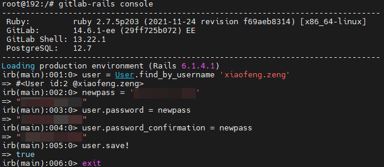

# GitLab

## 安装部署

### 以Docker Engine的方式安装

- 拉取gitlab-ee镜像

```sh
docker pull gitlab/gitlab-ee:lastest
```

- 运行容器

```sh
# 重点关注以下参数 --hostname -p
docker run -d \
  --hostname 192.168.1.36 \
  -p 443:443 \
  -p 8021:80 \
  -p 8022:22 \
  --name gitlab-ee \
  --restart always \
  -v /opt/env/docker/gitlab-ee/config:/etc/gitlab \
  -v /opt/env/docker/gitlab-ee/logs:/var/log/gitlab \
  -v /opt/env/docker/gitlab-ee/data:/var/opt/gitlab \
  --shm-size 256m \
  --privileged=true \
  gitlab/gitlab-ee
```

- 配置gitlab

```sh
vi /etc/gitlab/gitlab.rb

external_url 'http://192.168.1.36'
gitlab_rails['gitlab_ssh_host'] = '192.168.1.36'
gitlab_rails['gitlab_shell_ssh_port'] = 8022

# 如果内存不足时，则puma关闭，否则浏览器访问会出现502错误
puma['enable'] = false
```

```sh
vi /var/opt/gitlab/gitlab-rails/etc/gitlab.yml

# 修改http的端口
production: &base
  gitlab:
    port: 8021
```

## GitLab使用

### 服务端常用指令

```sh
gitlab-ctl start # 启动所有 gitlab 组件
gitlab-ctl stop # 停止所有 gitlab 组件
gitlab-ctl restart # 重启所有 gitlab 组件
gitlab-ctl status # 查看服务状态
gitlab-ctl reconfigure # 启动服务
vim /etc/gitlab/gitlab.rb # 修改默认的配置文件
gitlab-rake gitlab:check SANITIZE=true --trace # 检查gitlab
gitlab-ctl tail # 查看日志
```

### 用户/群组/项目管理

1. 新增用户可以通过超级管理员用户`root`进入`Admin Area`进行新增**用户/群组/项目**

2. 用户密码更改<sup>2</sup>

    - 可以通过UI界面进行更改；

    - 也可以通过服务端进行更改

      ```sh
      # 进入Rails console
      gitlab-rails console

      # 三种方式查找用户
      # 1. 通过用户名查找用户
      user = User.find_by_username 'exampleuser'
      # 2. 通过用户ID查找用户
      user = User.find(123)
      # 3. 通过电子邮箱查找用户
      user = User.find_by(email: 'user@example.com')

      # 重置密码
      new_password = 'examplepassword'
      user.password = new_password
      user.password_confirmation = new_password

      # 保存用户信息
      user.save!

      exit
      ```

      

### 用户配置（SSH配置）

[参考Github配置SSH Key](tool_cvs_git.html#配置-与github关联)

## GitLab团队合作<sup>2<sup>

## 参考文档

1. [重置密码](https://docs.gitlab.com/ee/security/reset_user_password.html#reset-your-root-password)
2. [Git+GitLab团队协作](https://www.jianshu.com/p/95991a646f72)
