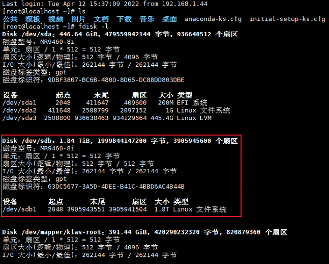
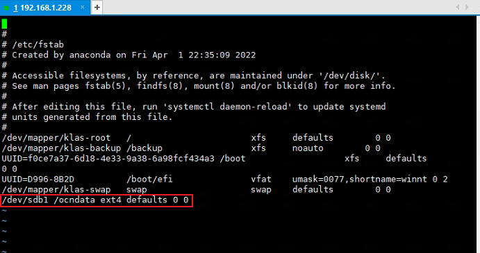
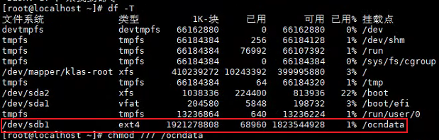

# Linux
## 常用操作

### 基本操作语法

- `&` 表示衔接操作，完成<u>操作符前</u>的指令后立即操作后续衔接的指令
- `|` 表示管道操作符，用于将该<u>操作符前</u>的操作返回结果作为<u>操作符后</u>的输入

### 用户/组操作

```sh
# 添加组
# groupadd <opt> <group>
# -g：指定用户组ID
groupadd -g <gid> <group>

# 添加用户
# useradd <opt> <user>
# -u：用户，指定用户ID
# -g：用户组，指定用户组ID
# -m：用户主目录
useradd -m <mainDir> -u <uid> -g <gid> <user>

# 用户附加组
# -G: 修改用户所属的附加群组
usermod -G <group1> [<group2>...]

# 删除组
groupdel <group>

# 删除用户
userdel <user>
```

### 文件操作

#### 创建目录

```sh
# -p 表示如果不存在在新建
mkdir -p <dirName>
```

#### 创建文件

```sh
# 单纯新建文件
touch <file>

# 输出指定内容并新建
# >：表示如果现有文件已经存在则覆盖
echo <content> > <file>
cat > <file>
```

#### 目录/文件授权


- 文件类型（file-type）：
  - `d` -> 目录
  - `-` -> 文件
  - `l` -> 表示为链接文档(link file)
  - `b` -> 表示为装置文件里面的可供储存的接口设备(可随机存取装置)
  - `c` -> 表示为装置文件里面的串行端口设备，例如键盘、鼠标(一次性读取装置)

- rwx对照表：
  - `r` -> readable，权重值为`4`
  - `w` -> writeable，权重值为`2`
  - `x` -> executable，权重值为`1`

| value | permission |     detail     |
| ----- | :--------: | :------------: |
| 1     |     x      |      执行      |
| 2     |     w      |      写入      |
| 3     |    -wx     |   写入+执行    |
| 4     |     r      |      读取      |
| 5     |    r-x     |   读取+执行    |
| 6     |    rw-     |   读取+写入    |
| 7     |    rwx     | 读取+写入+执行 |

```sh
# 目录/文件赋予权限
# 修改目录/文件所属用户与组
# -R: 表示递归设置
chown <user>[:<group>] [<dirName>|<fileName>]

# 修改目录/文件权限
chmod <permssion> [<dirName>|<fileName>]
# chmod 755 file.txt
```

### 查看系统进程情况

```sh
# 查看进程是否存在（可获取进程号）
ps -ef | grep [<key>|<port>...]

# 杀死进程
kill -9 <pid>
```

### 查看机器硬件使用情况

```sh
# 查看内存（内存总量+内存使用量+内存使用率）
# free -k：以kb为单位，查看内存使使用情况
# sed -n '2p'：流编辑器，只输出第二行（输出那些匹配的行）
# awk '{print $2}'：每行按空格或TAB分割，输出文本中的第二项
free -k | sed -n '2p' | awk '{print "total: "$2" KB, used: "$3" KB,used percent: "$3*100/$2"%"}'
```

### 防火墙的启动与停止

```sh
# 查看防火墙状态 
systemctl status firewalld

# 开启防火墙 
systemctl start firewalld  

# 关闭防火墙
systemctl stop firewalld
```

### 端口检查/开放/关闭

```sh
# 查看端口是否开放
# port: 表示端口号
firewall-cmd --query-port=<port>/tcp

# 添加指定开放端口(永久开放)
# port: 表示端口号
firewall-cmd --add-port=<port>/tcp --permanent

# 移除指定开放端口(永久关闭)
# port: 表示端口号
firewall-cmd --remove-port=<port>/tcp --permanent

# 端口设置生效
firewall-cmd --reload
```

## 硬件挂载

### 外接硬盘挂载<sup>1,2,3</sup>

- 1. 通过指令找到外接硬盘

```sh
# 列出所有硬盘信息
fdisk -l
```



- 2. 新建需要将外接硬盘挂接到的目标目录

```sh
# 新建目录
# 在根目录上创建数据存放的目录 ocndata
mkdir /ocndata
```

- 3. 挂载外接硬盘至目标目录

```sh
# 将磁盘路径/dev/sdb1挂载至/ocndata目录
# mount {磁盘路径} {挂载目录}
mount /dev/sdb1 /ocndata
```

- 4. 对目标目录授予权限

```sh
# 对该目录授予最高权限
# chmod {权限等级} {目录}
chmod 777 /ocndata
```

- 5. 设置开机自动挂载（可选，但最好进行配置）

```sh
# 编辑/ext/fstab文件
vi /etc/fstab

# 在/ext/fstab文件的最后插入一行，保存并退出
# 说明： {磁盘路径} {挂载目录} {磁盘类型} {参数} {能否被dump备份命令作用} {是否检验扇区}
/dev/sdb1 /ocndata ext4 defaults 0 0
```



- 6. 查看挂载情况，出现该目标目录即可

```sh
df -T
```



#### 参考文档

1. [Linux挂载移动硬盘](https://www.jianshu.com/p/3d8e19e79868)

2. [linux挂载新硬盘--fdisk挂载](https://blog.csdn.net/Neighbor_L/article/details/105998009)

3. [linux挂载新硬盘--parted命令](https://blog.csdn.net/Neighbor_L/article/details/105998256)
