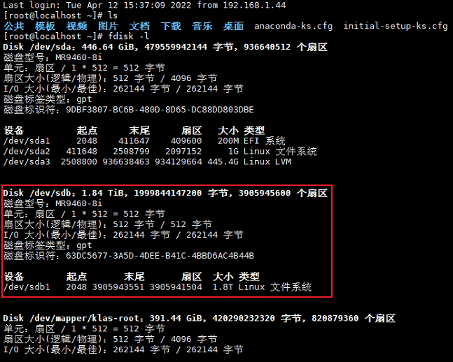

# 常用操作

## 硬件挂载

### 外接硬盘挂载<sup>1,2,3</sup>

- 1. 通过指令找到外接硬盘

```sh
# 列出所有硬盘信息
fdisk -l
```



- 2. 新建需要将外接硬盘挂接到的目标目录

```sh
# 新建目录
# 在根目录上创建数据存放的目录 ocndata
mkdir /ocndata
```

- 3. 挂载外接硬盘至目标目录

```sh
# 将磁盘路径/dev/sdb1挂载至/ocndata目录
# mount {磁盘路径} {挂载目录}
mount /dev/sdb1 /ocndata
```

- 4. 对目标目录授予权限

```sh
# 对该目录授予最高权限
# chmod {权限等级} {目录}
chmod 777 /ocndata
```

- 5. 设置开机自动挂载（可选，但最好进行配置）

```sh
# 编辑/ext/fstab文件
vi /etc/fstab

# 在/ext/fstab文件的最后插入一行，保存并退出
# 说明： {磁盘路径} {挂载目录} {磁盘类型} {参数} {能否被dump备份命令作用} {是否检验扇区}
/dev/sdb1 /ocndata ext4 defaults 0 0
```


- 6. 查看挂载情况，出现该目标目录即可

```sh
df -T
```


#### 参考文档

1. [Linux挂载移动硬盘](https://www.jianshu.com/p/3d8e19e79868)

2. [linux挂载新硬盘--fdisk挂载](https://blog.csdn.net/Neighbor_L/article/details/105998009)

3. [linux挂载新硬盘--parted命令](https://blog.csdn.net/Neighbor_L/article/details/105998256)
